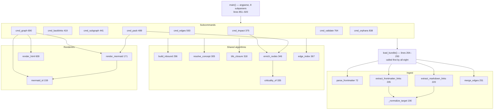

# OKF Graph Engineering Plugin — Code Walkthrough

Read with the [Design Doc](/docs/designs/2026-08-01_v0.3.0-release_design_doc.md). Where this
document and that one disagree, the code wins — see §6.

Generated against v0.3.0 (`6bf5d65`). Every claim cites
`path — symbol(), lines N–M`, read from the tree at that commit.

---

# 1. Orientation

**In three sentences.** `okf-graph-eng` is a Claude Code plugin that treats a
directory of Markdown as a graph: files are nodes, links are edges, YAML
frontmatter carries types and relations. Seven Markdown skills tell the host
model *when* to do graph work; one 924-line Python script does it
deterministically across eight subcommands. Everything else in the repository —
the sample bundle, the tests, the hooks, CI — exists to keep that script honest.

## 1.1 Directory map

| Path | What lives here | Why |
|---|---|---|
| `.claude-plugin/plugin.json` | Manifest: name `okf-graph-eng`, version `0.3.0` | The host's entry point |
| `.claude-plugin/marketplace.json`, `marketplace.json`, `.grok-plugin/marketplace.json` | Three more copies of the version | Install paths for Claude Code and Grok Build. All four are asserted equal by a test |
| `skills/` (7 dirs) | `SKILL.md` per skill, plus `templates/` and `references/` | The portable intelligence. Auto-triggered by the description in each file's frontmatter |
| `commands/` (7 files) | Slash-command wrappers | One per skill as of v0.3.0 (`okf-visualize` and `okf-maintain` were added) |
| `agents/graph-engineer.md` | Specialist subagent | Multi-hop work in an isolated context |
| `hooks/hooks.json` | `PostToolUse` → `okf-curate.sh` | The plugin's only host hook |
| `hooks/pre-commit`, `commit-msg`, `pre-merge-commit` | Git hooks (vendored worklog) | Log invariants, roadmap freshness, graph tests, ULID-in-message |
| `scripts/okf-graph.py` | **The graph engine**, 924 lines | Everything deterministic |
| `scripts/okf-curate.sh` | 78 lines of Bash | Post-edit validation |
| `scripts/okf-ticket-link.py` | 220 lines | worklog / GitHub → `TicketLink` concepts |
| `scripts/substack_okf.py` | 917 lines | End-to-end integration harness (§2.6). Output is gitignored |
| `tests/test_okf_graph.py` | 16 plain-assert cases | The only automated coverage in the repo |
| `sample-okf/` | 22 concepts, 83 edges | Worked example *and* CI tripwire |
| `.github/workflows/worklog.yml` | One workflow, four steps | The non-bypassable gate |
| `bin/`, `.work/`, `adapters/` | Vendored WikiTicket SDD tooling | Project management, orthogonal to the plugin |
| `docs/` | Plans, roadmap, user guide, designs, generated IA index | This file lives here |

## 1.2 The one diagram that explains the architecture

Derived from the actual call graph in `scripts/okf-graph.py`.



**How to read it.** Strictly top-down; there are no cycles. `render_html()`
receives already-rendered Mermaid lines as a parameter (line 614) rather than
calling `render_mermaid()` — that is what lets `cmd_graph()` patch the line list
before handing it to either output path (§2.4).

---

# 2. Execution-order tour

## 2.1 Entry: `main()` — lines 851–920

Eight subparsers, then a manual dispatch chain. Two things happen before any
subcommand sees an argument:

```python
    args = p.parse_args()
    bundle = Path(args.bundle).resolve()
    if not bundle.is_dir():
        print(json.dumps({"error": f"bundle not found: {bundle}"}))
        return 1
```
`scripts/okf-graph.py — main(), lines 898–902`

Every subcommand therefore receives an absolute, existing directory. The error
shape (`{"error": …}` on stdout, exit 1) is the same one the subcommands use for
an unresolvable concept, so a caller has one failure format to parse.

`impact` and `backlinks` share a subparser loop (855–858) because their arguments
are identical. The rest are declared individually.

## 2.2 Ingest: `load_bundle()` — lines 264–293

Every subcommand's first line. It is 30 lines and does five things.

```python
    for path in sorted(bundle.rglob("*.md")):
        if path.name.startswith("."):
            continue
        rel = path.relative_to(bundle).as_posix()
        text = path.read_text(encoding="utf-8", errors="replace")
        meta = parse_frontmatter(text)
        md_edges = extract_markdown_links(text, path, bundle)
        fm_edges = extract_frontmatter_links(meta, path, bundle)
        edges = merge_edges(md_edges, fm_edges)
```
`lines 266–274`

**Receives:** a resolved bundle path. **Returns:** `dict[str, Concept]` keyed by
bundle-relative POSIX path. **Can fail:** it cannot — `errors="replace"` means
undecodable bytes become replacement characters instead of an exception, and
`parse_frontmatter()` has no error path.

`sorted()` is not cosmetic: it makes the dict insertion order deterministic,
which matters because `resolve_concept()` returns the first match in iteration
order (§2.7).

Then the part that is easy to misread:

```python
    # Drop outbound edges that do not resolve to loaded concepts (broken links
    # remain detectable via validate, which re-reads edges from disk metadata).
    # Keep edge objects for validate; filter adjacency for graph traversal only.
    for c in concepts.values():
        c.outbound = [t for t in c.outbound if t in concepts]
```
`lines 288–292`

**Two link lists, on purpose.** `Concept.outbound` is the traversal adjacency and
is pruned to real targets. `Concept.edges` keeps everything, including dangling
targets. Traversal can never walk into a void; `cmd_validate()` can still report
the dangle. Merging these two lists would break one or the other — this is the
single most load-bearing subtlety in the file.

## 2.3 Parsing: `parse_frontmatter()` — lines 72–156

The most intricate function in the repository, and the one that shipped a defect
in v0.2.0. It is a line-oriented state machine with three states tracked in three
locals declared at lines 80–83: `in_links`, `current`, and `pending_list_key`.

**The v0.3.0 addition** — block sequences:

```python
        # block-sequence items belonging to the previous bare `key:`
        if pending_list_key is not None:
            item = re.match(r"^-\s+(.*)$", stripped)
            if item:
                if not isinstance(meta.get(pending_list_key), list):
                    meta[pending_list_key] = []
                meta[pending_list_key].append(item.group(1).strip().strip('"').strip("'"))
                continue
            # no list materialized; the bare key keeps its empty-string value
            pending_list_key = None
```
`lines 121–130`

`pending_list_key` is armed whenever a key has an empty value (lines 137–140),
and disarmed by the first line that is not a list item. Before v0.3.0 this
machinery did not exist: `tags:` followed by `- alpha` left `tags` as `''`, which
`load_bundle()`'s guard then converted to `[]`:

```python
            tags=list(meta.get("tags") or []) if isinstance(meta.get("tags"), list) else [],
```
`load_bundle(), line 282`

Two silent coercions in series, no warning at either. Every generator in this
repository emits inline `tags: [a, b]`, so `sample-okf` looked clean and only
user-authored bundles were affected. The regression test says so in its own
docstring:

```python
def test_frontmatter_block_sequence():
    """Standard YAML block sequences must parse. Regression: these silently
    became '' and were then coerced to [] by the isinstance guard."""
```
`tests/test_okf_graph.py — lines 47–49`

**The `links:` sub-machine** (lines 91–119) is older and separate. It collects a
list of mappings, treating an indented `k: v` as a continuation of the current
item (108–113) and any unindented key line as the end of the block (114–119).
Note line 104: a list item whose text starts with `{` is *not* split on `:` —
flow-style mappings are declined rather than mis-parsed.

**What it does not handle:** nested maps, multi-line scalars, anchors, aliases,
comments after values. It is not YAML and does not claim to be. The reason it
exists at all is that PyYAML is not in the standard library, and a plugin that
must work on two hosts with a copy of one file cannot require an install step.

## 2.4 Rendering: `mermaid_id()` and `render_mermaid()` — lines 159–187

Extracted in v0.3.0 so that `pack` and `graph` cannot draw different diagrams
from the same data. `mermaid_id()` carries its own bug history in the docstring:

```python
def mermaid_id(rel: str) -> str:
    """Mermaid-safe node id from the *full* relative path.

    Deriving ids from the stem collapses every `index.md` in the bundle into
    one node (sample-okf has seven), and merges `agents/foo.md` with
    `docs/foo.md`.
    """
    ident = re.sub(r"[^A-Za-z0-9_]", "_", rel)
    first = ident[:1]
    return ident if first.isalpha() or first == "_" else "n" + ident
```
`lines 159–168`

Two rules: identifier-safe characters only, and never a leading digit (a path
like `2024/notes.md` gets an `n` prefix). Both are asserted directly:

```python
    for rel in ("agents/index.md", "2024/notes.md", "a b/c.d.md"):
        mid = g.mermaid_id(rel)
        assert mid.replace("_", "").isalnum(), mid
        assert not mid[0].isdigit(), mid
```
`tests/test_okf_graph.py — test_mermaid_ids_are_unique_per_path(), lines 103–107`

`render_mermaid()` (171–187) makes two passes: declare each node once with its
title as the label, then emit the edges, labelling only relations other than the
generic `links_to` (line 185). It declares **only nodes it sees on an edge** —
which is why `cmd_graph()` has to repair the isolated ones (§2.5).

## 2.5 `cmd_graph()` — lines 690–761, the v0.3.0 headline

Backs the `okf-visualize` skill, which before v0.3.0 instructed the model to
crawl concepts by hand.

**Node selection.** Without `--focus`, `nodes = sorted(concepts)` (line 702).
With it, an undirected neighborhood BFS:

```python
        undirected: dict[str, list[str]] = defaultdict(list)
        for k, c in concepts.items():
            for o in c.outbound:
                undirected[k].append(o)
                undirected[o].append(k)
        neighbors = {k: sorted(set(v)) for k, v in undirected.items()}
        nodes = [root] + [x["id"] for x in bfs_closure(root, neighbors, hops=hops)]
```
`lines 709–715`

**Edge selection** keeps only pairs with both endpoints in the node set
(line 718) — which is what makes `test_graph_json_shape()` able to assert there
are no dangling endpoints (lines 172–173).

**The isolated-node repair**, and why it exists, in the code's own words:

```python
    lines = render_mermaid(edges, concepts)
    # render_mermaid only declares nodes it sees on an edge; isolated concepts
    # would otherwise disappear from the diagram but stay in the JSON view.
    linked = {e["from"] for e in edges} | {e["to"] for e in edges}
    for n in nodes:
        if n not in linked:
            label = concepts[n].title.replace('"', "'")
            lines.append(f'  {mermaid_id(n)}["{label}"]')
```
`lines 745–752`

The test that pins it compares the two views against each other rather than
against a golden file:

```python
    _, doc = run_script("graph", "sample-okf", "--format", "json")
    for n in doc["nodes"]:
        assert g.mermaid_id(n["id"]) in out, f"{n['id']} missing from mermaid"
```
`tests/test_okf_graph.py — lines 157–159`

**Output shape.** This is the one subcommand that does not always print JSON. Its
docstring argues the case (lines 691–699): "a rendered graph is the only product
here, so wrapping it would force every caller through `jq -r` before it could be
pasted into a doc or written to a file."

**`render_html()`** (609–687) is a single f-string: inlined CSS with a
`prefers-color-scheme: dark` block, the Mermaid source in `<pre class="mermaid">`,
and two tables carrying the same data for renderers that do not understand it.
`e = html.escape` is bound at line 622 and applied to every interpolated value.
The docstring states the constraint: "No CDN, no JS, no network fetches — the
file must open from disk and from a locked-down viewer."

The test enforces that as a list of forbidden tokens:

```python
    assert "http://" not in out and "https://" not in out, "external reference in html"
    for tag in ("<script", "src=", "@import", "url("):
        assert tag not in out, f"external/executable resource in html: {tag}"
```
`tests/test_okf_graph.py — lines 207–209`

## 2.6 `cmd_pack()` — lines 489–590, the progressive-disclosure path

The plugin's differentiator: a bounded, ranked, self-describing context pack.

**Default traversal is outbound-only**, and the docstring explains why:

```python
    """Progressive disclosure context pack — default 2 hops, outbound-only BFS.

    Outbound-only keeps packs inside a theme (e.g. group → members) instead of
    flooding through hub catalogs that link everything. Pass undirected=True
    for neighborhood exploration.
    """
```
`lines 490–495`

A bundle's `index.md` links to everything. An undirected 2-hop walk from any leaf
reaches the index, and from there the whole bundle — the pack would be the tree
it was supposed to replace.

**Two different sorts, deliberately.** `score()` (518–528) decides *what survives
the `--max-nodes` cut*: root first, then verified, then high-impact type, then
title. `read_order` (542–549) decides *presentation order* and additionally
promotes `SharedState`. They look similar and are not interchangeable.

**Untrusted nodes are flagged, not dropped:**

```python
        if not c.verified and c.type in HIGH_IMPACT_TYPES:
            flag = " ⚠ unverified high-impact"
```
`lines 564–565`

**Truncation is always disclosed** — up to 15 excluded titles, then "… and N
more" (572–577). The pack tells the reader what it withheld.

**Output** is a JSON envelope carrying `included`, `excluded`, `edges`, *and* a
`markdown` rendering (580–588). Structured data is the product; the Markdown is a
convenience. This is the deliberate contrast with `cmd_graph()`.

## 2.7 `resolve_concept()` — lines 305–315

Every concept-taking subcommand routes through it.

```python
    q = query.strip().lstrip("/")
    if q in concepts:
        return q
    q_lower = q.lower()
    for rel, c in concepts.items():
        if Path(rel).stem.lower() == q_lower or c.title.lower() == q_lower:
            return rel
        if rel.endswith(q) or rel.endswith(q + ".md"):
            return rel
    return None
```

Exact path first, then case-insensitive stem, case-insensitive title, or path
suffix. **First match wins in dict iteration order** — which is insertion order,
which is `sorted()` from `load_bundle()`. Deterministic within a bundle, but not
obvious: two concepts sharing a stem resolve to whichever sorts earlier. Nothing
warns about the ambiguity.

## 2.8 `cmd_validate()` — lines 764–835, and the `--strict` contract

Eight rules across three severities (the full table is in the design doc, §13).
The interesting part is the last three lines:

```python
    # Default stays lenient: the skills call validate and expect 0 on warnings.
    # --strict is for CI, which needs warnings to actually gate.
    return 1 if errors or (strict and warnings) else 0
```
`lines 833–835`

A bundle with an unverified `AgentNode` is in-progress, not broken. If the
default were strict, every skill that calls `validate` mid-conversation would
read a normal state as a failure. CI is the one caller that needs warnings to
bite, and it is the one caller that passes the flag
(`.github/workflows/worklog.yml`, "sample bundle stays valid").

The test proves both halves against one synthetic bundle whose only problems are
warnings:

```python
        assert lenient.returncode == 0, lenient.stdout
        assert strict.returncode == 1, strict.stdout
```
`tests/test_okf_graph.py — lines 234–235`

## 2.9 The automation path: `hooks.json` → `okf-curate.sh`

The hook fires on every `Write|Edit|MultiEdit` (`hooks/hooks.json:5`) and invokes
`"${CLAUDE_PLUGIN_ROOT}/scripts/okf-curate.sh"` with a 45-second timeout.

**The v0.2.0 defect and its fix.** The manifest previously passed `"$FILE_PATH"`.
No such environment variable exists — the host delivers the payload as JSON on
stdin — so the script bound an empty string and hit its first guard on every
edit. The hook had never run, in any install. Now:

```bash
FILE="${1:-}"
if [[ -z "$FILE" ]]; then
  FILE="$(python3 -c 'import json,sys
try:
    print(json.load(sys.stdin).get("tool_input", {}).get("file_path", ""))
except Exception:
    pass' 2>/dev/null || true)"
fi
```
`scripts/okf-curate.sh — lines 9–16`

`python3` rather than `jq`, with the reason given at lines 6–8: "the plugin
already requires python3 everywhere, jq is not guaranteed present."

**Bundle-root discovery** (`find_bundle_root(), lines 28–54`) walks up from the
edited file looking for an `index.md` containing `okf_version`, or a `.okf/`
directory, then falls back to the repo's `.okf/` or `sample-okf/`.

**The fallback validator** is this repository's own engine:

```bash
else
  # No external CLI: use this repo's own validator, which sits next to us and
  # understands typed edges. (The previous grep fallback also used `realpath
  # -m`, absent from stock macOS.)
  python3 "$(dirname "$0")/okf-graph.py" validate "$BUNDLE_ROOT" || true
fi
```
`lines 71–76`

Two problems fixed in one change: hand-rolled grep link checking replaced by the
real validator, and a `realpath -m` call removed that stock macOS does not have.

**Every path exits 0** and every validator call is suffixed `|| true` (65, 67,
70, 75). Curation reports; it never blocks an edit.

## 2.10 The integration harness: `scripts/substack_okf.py`

917 lines, five subcommands, and no reference from any skill, command, or hook.
It is not part of the plugin surface — it is the only test in the repository that
runs the engine against a bundle it did not hand-author, and its output tree is
gitignored (`.gitignore`: `integration/`, `integration-okf/`).

**Pipeline:** `fetch` (221–262) → `emit` (452–717) → `verify` (737–820), or all
three via `run` (863–873). `classify` (265–290) re-runs the taxonomy over cached
JSON with no network.

**Classification is pure and reproducible.** `classify_type()` (134–151) is
ordered regex over title + subtitle, falling through to `one-off`.
`classify_subjects()` (154–160) is all-match across twelve rules, defaulting to
`["general"]`. Neither touches the network, so a cached `articles.json` reclassifies
identically forever.

**Fetching is defensive.** `http_get()` (77–97) tries `urllib` with a custom
User-Agent and falls back to a `curl -sL` subprocess; the comment at line 78
gives the reason — "Substack often 403s". The `/feed` snapshot is best-effort and
its failure is caught and printed (229–233).

**Emit is destructive on purpose:**

```python
    if bundle.exists():
        # clean previous emit (bundle only)
        for md in bundle.rglob("*.md"):
            md.unlink()
```
`lines 470–473`

A shrinking article set cannot leave stale concepts behind. It deletes only
`*.md`, leaving raw JSON alongside — and it is why the default output root is
`integration/` (line 29) and why that path is gitignored.

**All four type hubs are always emitted, even when empty** (488–490, "so catalogs
are stable"): an empty hub renders a placeholder bullet rather than vanishing and
breaking inbound links from the knowledge index.

**`verify` is the actual integration contract** (737–820). It shells out to
`okf-graph.py` via `run_graph()` (725–734) and asserts: every article has a valid
type and a non-empty subject list; the file count on disk matches the JSON;
`validate` exits 0 with zero errors; `impact` on the largest non-`ai-news` subject
hub returns at least one `knowledge/articles/` neighbor; and `pack --hops 2
--max-nodes 30` on that hub returns at least two nodes.

**Not on any gate.** It needs the network, so neither CI nor the pre-commit hook
runs it.

---

# 3. Load-bearing invariants

| # | Invariant | Enforced at | What breaks if violated |
|---|---|---|---|
| I1 | `Concept.rel` (bundle-relative POSIX path) is the *only* identity | `load_bundle():269, 287`; `mermaid_id()`; every edge endpoint | The v0.2.0 Mermaid bug: the renderer used the stem instead, and seven `index.md` files became one node |
| I2 | `outbound` is filtered to loaded concepts; `edges` is not | `load_bundle():288–292` | Filter both → `validate` goes blind to broken links. Filter neither → BFS walks into missing keys |
| I3 | `validate` exits 0 on warnings unless `--strict` | `cmd_validate():833–835` | Every skill that calls `validate` mid-conversation reads a normal in-progress bundle as a failure |
| I4 | Frontmatter typed relations beat plain Markdown links for the same target | `merge_edges():251–261` | A concept could not upgrade a prose link to `depends_on` without duplicating it |
| I5 | A link target that resolves outside the bundle is not an edge | `_normalize_target():211–214` (`ValueError` branch) | `../../` links pull external files into the graph, into packs, and into the HTML map |
| I6 | The HTML map contains no script, no external reference, no network fetch | `render_html():609–687`; asserted by `test_graph_html_is_self_contained()` | The artifact stops being safe to open in a locked-down viewer |
| I7 | Every interpolated value in the HTML map is `html.escape`d | `render_html():622–635` | A crafted `title:` injects markup into a generated file |
| I8 | The four version manifests agree | `test_version_is_consistent_across_manifests():238–255` | Silent version drift between Claude Code and Grok Build install paths |
| I9 | `sample-okf` stays at 22 concepts / 83 edges unless deliberately changed | `test_sample_bundle_validates():127–128` | The skills quote these numbers; a surprise change means an unreviewed edit |
| I10 | `.work/*.jsonl` files end with a newline | `hooks/pre-commit`, trailing-newline check | Union merge fuses two events into one unparseable line and both are lost |
| I11 | `docs/roadmap.md` is generated, never hand-edited | `hooks/pre-commit` regenerates and diffs it | Roadmap silently diverges from the work items that are its source |
| I12 | Every non-merge commit references a ULID or `#123` | `hooks/commit-msg` | Work stops being traceable to a tracked item |

---

# 4. Tests as executable specification

`tests/test_okf_graph.py` — 16 cases, plain `assert`, no framework, no fixtures,
no dependencies. Its own docstring bounds the ambition (lines 6–9): "Kept
deliberately small: it exists to catch the defects that shipped in v0.2.0 …
and to stop sample-okf and the four version manifests from drifting."

Four cases carry most of the weight.

## 4.1 The block-sequence regression — lines 47–56

```python
    meta = g.parse_frontmatter(
        "---\ntitle: X\ntags:\n  - alpha\n  - beta\nstatus: draft\n---\nbody\n"
    )
    assert meta["tags"] == ["alpha", "beta"], f"block-seq tags dropped: {meta}"
    # the key after the list must still parse
    assert meta["status"] == "draft", meta
```

**Rule proved:** standard YAML block sequences parse, *and* the state machine
disarms correctly afterwards. **Catches:** a `pending_list_key` that is never
cleared — which would swallow every subsequent key in the block. The second
assertion is the one most likely to fail on a careless refactor.

## 4.2 Mermaid ID uniqueness — lines 96–108

```python
    a = g.mermaid_id("agents/index.md")
    b = g.mermaid_id("workflows/index.md")
    assert a != b, f"index.md collision: {a} == {b}"
```

**Rule proved:** node identity is the full path. **Catches:** any return to
stem-derived ids — the exact v0.2.0 defect, where all seven `index.md` files in
`sample-okf` collapsed into one node.

## 4.3 The self-contained HTML contract — lines 201–214

```python
    assert out.startswith("<!doctype html>"), out[:40]
    assert "http://" not in out and "https://" not in out, "external reference in html"
    for tag in ("<script", "src=", "@import", "url("):
        assert tag not in out, f"external/executable resource in html: {tag}"
    assert '<pre class="mermaid">' in out and "graph LR" in out
```

**Rule proved:** the map is a security and portability artifact, not just a
rendering. **Catches:** the natural "improvement" of adding a Mermaid CDN script
tag to make the diagram render everywhere. It then cross-checks the HTML tables
against the JSON view (212–214), so a table cannot silently drop a concept.

## 4.4 Strict vs lenient — lines 217–235

```python
        (bundle / "index.md").write_text("---\ntitle: Root\nokf_version: 0.2\n---\n")
        # missing type and title -> warn, not error
        (bundle / "loose.md").write_text("---\ndescription: no type here\n---\n")
```

A two-file synthetic bundle whose only defects are warnings, run twice. **Rule
proved:** the exit-code contract in both directions. **Catches:** a well-meant
change that makes `validate` strict by default, which would break every skill
that calls it.

## 4.5 The drift tripwires — lines 121–128 and 238–255

`test_sample_bundle_validates()` asserts literal counts (22 / 83) with the
rationale inline. `test_version_is_consistent_across_manifests()` reads four
JSON files by key path, skipping any that do not exist, and asserts one distinct
value. Neither tests behavior; both catch unreviewed edits. Verified at v0.3.0:
`validate sample-okf --strict` reports 22 concepts, 83 edges (13 typed), 0
errors, 0 warnings, 0 issues.

## 4.6 One infrastructure detail worth knowing

```python
    spec = importlib.util.spec_from_file_location("okf_graph", SCRIPT)
    mod = importlib.util.module_from_spec(spec)
    sys.modules["okf_graph"] = mod
    spec.loader.exec_module(mod)
```
`load_graph_module(), lines 31–34`

`okf-graph.py` is not an importable module name (the hyphen). The
`sys.modules` registration is load-bearing and the docstring says why: "without
it the `@dataclass` decorators raise `AttributeError` on Python 3.13, because
dataclasses looks the class's module up in `sys.modules` and gets None." Delete
that line and every test errors before the first assertion.

## 4.7 Where the tests run

```yaml
      - name: graph engine tests
        run: python3 tests/test_okf_graph.py -q
      - name: sample bundle stays valid
        run: python3 scripts/okf-graph.py validate sample-okf --strict
```
`.github/workflows/worklog.yml`

The workflow comment states the change v0.3.0 made: "The graph engine is what the
plugin exists to do; nothing exercised it before v0.3.0." The same suite runs in
`hooks/pre-commit`, guarded on the file existing so scaffolded repos without a
`tests/` directory do not fail:

```bash
[ ! -f tests/test_okf_graph.py ] || python3 tests/test_okf_graph.py -q >/dev/null 2>&1 || fail "graph tests failing — run: python3 tests/test_okf_graph.py"
```

The local hook is bypassable with `--no-verify`; CI is not.

---

# 5. Junior engineer orientation

## 5.1 The five things to internalize

1. **A concept's identity is its bundle-relative path.** Not its stem, not its
   title. Every bug in the renderer's history came from forgetting this (I1).
2. **`outbound` and `edges` are two different lists on purpose.** One is for
   walking the graph, one is for validating it (I2).
3. **`validate` is lenient by default and that is a contract, not an oversight.**
   The skills depend on exit 0 for warnings (I3).
4. **The frontmatter parser is not YAML.** It handles scalars, booleans, inline
   lists, block sequences, and the `links:` mapping list. Anything else degrades
   silently — there is no error channel.
5. **The plugin writes nothing and calls nothing.** Standard library, local
   filesystem, read-only. Any change that adds a dependency or a network call
   changes what the plugin *is*.

## 5.2 Where to start debugging

| Symptom | Start here |
|---|---|
| A link is not showing up as an edge | `_normalize_target(), lines 190–217` — then check it resolves inside the bundle |
| A frontmatter key is missing or empty | `parse_frontmatter(), lines 72–156` — check the state machine, especially `pending_list_key` |
| A concept is missing from a diagram | `render_mermaid()` declares only nodes on an edge; `cmd_graph():745–752` repairs isolated ones. `pack` does **not** |
| A pack is too big, too small, or off-topic | `cmd_pack():503–531` — check the adjacency mode (`--undirected`?) then `score()` |
| `validate` is unexpectedly non-zero | `cmd_validate():833–835` — is `--strict` set? Are there real errors, or only warnings? |
| The wrong concept was resolved | `resolve_concept(), lines 305–315` — first match wins over stem, title, and suffix |
| The post-edit hook did nothing | `okf-curate.sh:19–25` — the path filter, then `find_bundle_root()` |
| CI fails on counts | `test_sample_bundle_validates():127–128` — you edited `sample-okf` and owe the two numbers an update |

## 5.3 Where common changes go

| Change | Files |
|---|---|
| New subcommand | `scripts/okf-graph.py`: a `cmd_*` function, a subparser in `main()` (851–897), a dispatch line (904–919). Then `docs/user_guide/cli-reference.md` |
| New relation | `KNOWN_RELS`, lines 32–45. Unlisted relations still work; they get an `info` from `validate` |
| New impact type | `HIGH_IMPACT_TYPES` / `MEDIUM_IMPACT_TYPES`, lines 47–48. Changes pack ranking, criticality, and validate warnings at once |
| New skill | `skills/<name>/SKILL.md` plus `commands/<name>.md`. Keep the seven-and-seven parity |
| New output format | `--format` choices (line 883) and a branch in `cmd_graph()` (720–760) |
| Version bump | Four manifests — `.claude-plugin/plugin.json`, `marketplace.json`, `.claude-plugin/marketplace.json`, `.grok-plugin/marketplace.json`. A test enforces agreement |

## 5.4 Risky to modify

| File / function | Why |
|---|---|
| `parse_frontmatter()` | A state machine with three interacting states and a history of silent failures. Add a test before you touch it |
| `load_bundle():288–292` | The two-link-list invariant. Non-obvious, and breaking it breaks either traversal or validation |
| `cmd_validate()`'s return | An exit-code contract every skill depends on |
| `render_html()` | Any added `src=`, `<script>`, or URL breaks I6 and fails CI |
| `mermaid_id()` | Node identity for every diagram the plugin emits |
| `sample-okf/**` | Two literal counts in the test suite |
| `hooks/hooks.json` | The stdin-JSON contract. Get it wrong and the hook silently never runs — for a whole release, as v0.2.0 demonstrated |

---

# 6. Gaps and design drift

## 6.1 Design-document claims the code did not support (now corrected)

Both `current_*` documents were dated 2026-07-29 and predated the v0.2.0 tag
(2026-07-31) as well as all of v0.3.0. The prior versions of these files were
wrong on the following points; each is fixed above.

| Prior claim | Reality at v0.3.0 |
|---|---|
| Graph script does "BFS impact / subgraph, trust-aware pack, edges listing, validate / orphans" | Eight subcommands. `backlinks` and the entire `graph` subcommand were missing from the list |
| No mention of `validate --strict` | Exists, is the CI gate, and carries an explicit exit-code contract |
| `scripts/` holds "`okf-graph.py`, `okf-ticket-link.py`, `okf-curate.sh`" | Four scripts. `substack_okf.py` (917 lines) was absent from every hand-written document in the repository |
| No `tests/` row in the top-level table | `tests/test_okf_graph.py` exists, runs in CI and pre-commit, and is the repo's only automated coverage |
| "Hooks under `hooks/` enforce ULID-in-commit and roadmap freshness" | Conflates the git hooks with the plugin's `PostToolUse` hook, and omits that pre-commit now also runs the graph tests and the ADR/IA gates |
| No mention of CI | `.github/workflows/worklog.yml` runs four steps, two of which are new in v0.3.0 |
| Frontmatter `git_hash: main` | Not a commit hash. The skill's frontmatter contract (tag / git_hash / branch / generated_at / roadmap) was unmet |

## 6.2 Code behavior not previously documented anywhere

- The two-link-list invariant (I2) — the subtlest rule in the engine.
- The lenient/strict exit-code contract (I3) and its reason.
- `pack`'s outbound-only default and the hub-flooding problem it avoids.
- `cmd_graph()`'s deliberate break from the JSON-everywhere convention.
- The entire `substack_okf.py` pipeline, its taxonomy, and its assertions.
- The `sys.modules` registration required to import the engine under Python 3.13.

## 6.3 Dead or redundant code (Confirmed)

- **`criticality_of(), line 342`** — `criticality = "critical" if criticality ==
  "high" else criticality`. Inside the enclosing `criticality != "low"` guard the
  only other reachable value is `"medium"`, for which this assigns the variable
  to itself. Medium-impact concepts never escalate on being unverified. The line
  is a no-op, not an output-changing bug.
- **`cmd_subgraph(), lines 449–457`** — builds the undirected map from
  `outbound_map` in both directions, then from `inbound_map` in both directions.
  `inbound_map` is by construction the reverse of `outbound_map`, so the second
  loop adds the same edges again. Harmless only because line 458 deduplicates
  with `sorted(set(v))`.
- **`docs/adr/`** is an empty directory, while `hooks/pre-commit` runs
  `worklog adr check` against it. The repository's actual decision records live
  in `sample-okf/decisions/`.

## 6.4 Missing tests

Five of eight subcommands — `impact`, `backlinks`, `subgraph`, `edges`,
`orphans` — have no direct output-shape test; they are exercised only
transitively. There is also no test for `criticality_of()` ordering, none for
`scripts/okf-ticket-link.py`, and none for `scripts/okf-curate.sh`. The v0.2.0
hook defect would not be caught today by anything except a human reading
`hooks.json`.

## 6.5 Inconsistencies worth knowing

- **`suggested_order` is inbound-only** (`cmd_impact():407`). The name suggests a
  complete update ordering; it lists only the concepts that reference the target.
- **`okf-curate.sh`'s path filter** (lines 22–25) keys on `.okf/`, `knowledge/`,
  or `sample-okf/` appearing in the path. A bundle rooted elsewhere — say
  `integration/substack-okf/index.md` — is skipped unless the edited file happens
  to sit under a `knowledge/` subdirectory.
- **`okf-ticket-link.py`** derives the filename from the current title
  (`emit():147–148`). Retitling an item writes a new file and leaves the old one.
- **Unknown relations are preserved, not normalized.**
  `extract_frontmatter_links():241–243` substitutes `related_to` only for an
  *empty* relation; an unrecognized non-empty relation survives and is reported
  at severity `info` by `validate`. This reads as a bug and is intentional — the
  relation vocabulary is advisory.

## 6.6 Confirmed vs inferred

Everything in §§1–5 and §6.1–6.5 was read directly from the tree at `6bf5d65`.
The counts (22 concepts, 83 edges, 13 typed, 0 errors, 0 warnings; 16 tests
passing) were produced by running `validate --strict`, `edges`, `graph --format
json`, and the test suite against that commit. The one inference in this document
is the *intent* behind §6.3's dead branch — the code's behavior there is
confirmed; whether the author meant medium to escalate is not, and is filed as an
open question in the design doc (§22 Q2).
