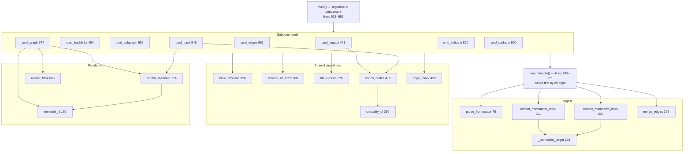

# OKF Graph Engineering Plugin — Code Walkthrough

Read with the [Design Doc](/docs/designs/2026-08-02_v0.3.1-release_design_doc.md). Where this
document and that one disagree, the code wins — see §6.

Generated against v0.3.1 (`c9c6c99`). Every claim cites
`path — symbol(), lines N–M`, read from the tree at that commit.

**Changed since the v0.3.0 edition.** v0.3.1 is a correctness release. The
tour's shape is the same; the stops that moved are §2.2 (dot-directories and
the off-bundle collector), §2.7 (`resolve_concept` — rewritten), §2.9 (the
curation hook — restructured), §2.9a (`criticality_of` — new stop), §4 (the
suite grew from 16 cases to 24, plus a shell test), and §6, where three of the
items the last edition listed as dead code or drift are now gone.

---

# 1. Orientation

**In three sentences.** `okf-graph-eng` is a Claude Code plugin that treats a
directory of Markdown as a graph: files are nodes, links are edges, YAML
frontmatter carries types and relations. Seven Markdown skills tell the host
model *when* to do graph work; one 986-line Python script does it
deterministically across eight subcommands. Everything else in the repository —
the sample bundle, the tests, the hooks, CI — exists to keep that script honest.

## 1.1 Directory map

| Path | What lives here | Why |
|---|---|---|
| `.claude-plugin/plugin.json` | Manifest: name `okf-graph-eng`, version `0.3.1` | The host's entry point |
| `.claude-plugin/marketplace.json`, `marketplace.json`, `.grok-plugin/marketplace.json` | Three more copies of the version | Install paths for Claude Code and Grok Build. All four are asserted equal by a test |
| `skills/` (7 dirs) | `SKILL.md` per skill, plus `templates/` and `references/` | The portable intelligence. Auto-triggered by the description in each file's frontmatter |
| `commands/` (7 files) | Slash-command wrappers | One per skill as of v0.3.0 (`okf-visualize` and `okf-maintain` were added) |
| `agents/graph-engineer.md` | Specialist subagent | Multi-hop work in an isolated context |
| `hooks/hooks.json` | `PostToolUse` → `okf-curate.sh` | The plugin's only host hook |
| `hooks/pre-commit`, `commit-msg`, `pre-merge-commit` | Git hooks (vendored worklog) | Log invariants, roadmap freshness, graph tests, ULID-in-message |
| `scripts/okf-graph.py` | **The graph engine**, 986 lines | Everything deterministic |
| `scripts/okf-curate.sh` | 75 lines of Bash | Post-edit validation |
| `scripts/okf-ticket-link.py` | 220 lines | worklog / GitHub → `TicketLink` concepts |
| `scripts/substack_okf.py` | 917 lines | End-to-end integration harness (§2.6). Output is gitignored |
| `tests/test_okf_graph.py` | 24 plain-assert cases | Regression net for the engine |
| `tests/test_okf_curate.sh` | 5 bash checks, new in v0.3.1 | Regression net for the curation hook. **Runs on no gate** — see §6.4 |
| `sample-okf/` | 22 concepts, 83 edges | Worked example *and* CI tripwire |
| `.github/workflows/worklog.yml` | One workflow, four steps | The non-bypassable gate |
| `bin/`, `.work/`, `adapters/` | Vendored WikiTicket SDD tooling | Project management, orthogonal to the plugin |
| `docs/` | Plans, roadmap, user guide, designs, generated IA index | This file lives here |

## 1.2 The one diagram that explains the architecture

Derived from the actual call graph in `scripts/okf-graph.py`.



**How to read it.** Strictly top-down; there are no cycles. `render_html()`
receives already-rendered Mermaid lines as a parameter (line 671) rather than
calling `render_mermaid()` — that is what lets `cmd_graph()` patch the line list
before handing it to either output path (§2.4).

---

# 2. Execution-order tour

## 2.1 Entry: `main()` — lines 913–982

Eight subparsers, then a manual dispatch chain. Two things happen before any
subcommand sees an argument:

```python
    args = p.parse_args()
    bundle = Path(args.bundle).resolve()
    if not bundle.is_dir():
        print(json.dumps({"error": f"bundle not found: {bundle}"}))
        return 1
```
`scripts/okf-graph.py — main(), lines 960–964`

Every subcommand therefore receives an absolute, existing directory. The error
shape (`{"error": …}` on stdout, exit 1) is the same one the subcommands use for
an unresolvable concept, so a caller has one failure format to parse.

`impact` and `backlinks` share a subparser loop (917–920) because their arguments
are identical. The rest are declared individually.

## 2.2 Ingest: `load_bundle()` — lines 286–321

Every subcommand's first line. It is 36 lines and does five things.

```python
    for path in sorted(bundle.rglob("*.md")):
        parts = path.relative_to(bundle).parts
        # skip dotfiles *and* dot-directories: pointed at a repo root, .work/,
        # .git/ and .claude/ are not concepts. Relative parts only — the
        # bundle itself may legitimately live under a dot-directory.
        if any(p.startswith(".") for p in parts):
            continue
        rel = path.relative_to(bundle).as_posix()
        text = path.read_text(encoding="utf-8", errors="replace")
        meta = parse_frontmatter(text)
        off_bundle: list[str] = []
        md_edges = extract_markdown_links(text, path, bundle, off_bundle)
        fm_edges = extract_frontmatter_links(meta, path, bundle, off_bundle)
        edges = merge_edges(md_edges, fm_edges)
```
`lines 288–301`

**Receives:** a resolved bundle path. **Returns:** `dict[str, Concept]` keyed by
bundle-relative POSIX path. **Can fail:** it cannot — `errors="replace"` means
undecodable bytes become replacement characters instead of an exception, and
`parse_frontmatter()` has no error path.

`sorted()` is not cosmetic: it makes the dict insertion order deterministic.
Before v0.3.1 that determinism was load-bearing in a bad way — it was the only
reason `resolve_concept()`'s first-match-wins behaviour was reproducible at all
(§2.7). It is now merely tidy.

**Two v0.3.1 changes are visible in that block.**

*The dot-check moved from the filename to the relative parts.* It used to read
`if path.name.startswith("."): continue`, which skipped `.hidden.md` but walked
straight into `.git/`, `.work/` and `.claude/`. Anyone who pointed the engine at
a repository root — a natural thing to try — got hundreds of phantom concepts.
The check now tests every component of the *bundle-relative* path, and the
comment explains why relative and not absolute: a bundle that itself lives under
a dot-directory (`~/.config/my-bundle/`, or the `.okf/` layout the curation hook
looks for) must still load. Pinned by
`test_load_bundle_skips_dot_directories(), lines 183–195`.

*An `off_bundle` list is allocated per concept and threaded into both
extractors.* It collects the raw text of link targets that resolved outside the
bundle — see §2.2a.

Then the part that is easy to misread:

```python
    # Drop outbound edges that do not resolve to loaded concepts (broken links
    # remain detectable via validate, which re-reads edges from disk metadata).
    # Keep edge objects for validate; filter adjacency for graph traversal only.
    for c in concepts.values():
        c.outbound = [t for t in c.outbound if t in concepts]
```
`lines 316–320`

**Two link lists, on purpose.** `Concept.outbound` is the traversal adjacency and
is pruned to real targets. `Concept.edges` keeps everything, including dangling
targets. Traversal can never walk into a void; `cmd_validate()` can still report
the dangle. Merging these two lists would break one or the other — this is the
single most load-bearing subtlety in the file.

## 2.2a The third list: `off_bundle` — new in v0.3.1

There is now a third collection of link targets, and it is neither of the above.

```python
    try:
        rel = cand.relative_to(bundle.resolve()).as_posix()
    except ValueError:
        if off_bundle is not None and t not in off_bundle:
            off_bundle.append(t)
        return None
```
`_normalize_target(), lines 223–228`

The `return None` is unchanged: a target outside the bundle is not an edge, and
nothing traverses it. What changed is the two lines above it. Before v0.3.1 the
`except` branch was bare — a mistyped `../../concepts/thing.md` produced *no
edge, no error, no warning, nothing*. The link did not exist as far as the
engine was concerned, which is the worst possible answer for a tool whose job is
telling you what links to what.

**Why a collector parameter and not a richer return type.** `_normalize_target()`
returns `str | None`, and three call sites plus a unit test depend on that. A
`tuple[str | None, str | None]` would have touched every one of them to carry a
diagnostic that most callers do not want. The optional list is invisible to a
caller that omits it — including `test_normalize_target()`, which still calls
with three arguments and still asserts `"../../elsewhere.md"` is `None`
(line 85).

**The de-duplication matters.** `t not in off_bundle` (line 226) means a page
linking five times to the same broken path yields one warning, not five.

The list is written in `_normalize_target()`, carried into the `Concept` by
`load_bundle()` (line 313), and read in exactly one place:

```python
        # warn, not error: the default exit code must stay 0 for the skills
        # and okf-curate.sh; --strict gates these in CI.
        for t in c.off_bundle:
            issues.append(
                {"severity": "warn", "path": rel, "message": f"link outside bundle → {t}"}
            )
```
`cmd_validate(), lines 832–837`

**Warn, not error, and the comment says why.** §2.8's exit-code contract is the
constraint: the skills and `okf-curate.sh` call `validate` with the lenient
default and read non-zero as failure. A stray `../../` is a probable typo, not a
corrupt bundle. `--strict` makes it bite, in CI, where it should.

`test_validate_reports_off_bundle_links(), lines 323–345` covers both link
sources — a Markdown link and a frontmatter `links:` entry, in the same file —
and asserts all four properties at once: two issues, both `warn`, both attributed
to `sub/page.md`, default exit 0 with `error_count == 0`, and `--strict` exit 1.

## 2.3 Parsing: `parse_frontmatter()` — lines 75–159

The most intricate function in the repository, and the one that shipped a defect
in v0.2.0. It is a line-oriented state machine with three states tracked in three
locals declared at lines 83–86: `in_links`, `current`, and `pending_list_key`.

**The v0.3.0 addition** — block sequences:

```python
        # block-sequence items belonging to the previous bare `key:`
        if pending_list_key is not None:
            item = re.match(r"^-\s+(.*)$", stripped)
            if item:
                if not isinstance(meta.get(pending_list_key), list):
                    meta[pending_list_key] = []
                meta[pending_list_key].append(item.group(1).strip().strip('"').strip("'"))
                continue
            # no list materialized; the bare key keeps its empty-string value
            pending_list_key = None
```
`lines 124–133`

`pending_list_key` is armed whenever a key has an empty value (lines 140–143),
and disarmed by the first line that is not a list item. Before v0.3.0 this
machinery did not exist: `tags:` followed by `- alpha` left `tags` as `''`, which
`load_bundle()`'s guard then converted to `[]`:

```python
            tags=list(meta.get("tags") or []) if isinstance(meta.get("tags"), list) else [],
```
`load_bundle(), line 309`

Two silent coercions in series, no warning at either. Every generator in this
repository emits inline `tags: [a, b]`, so `sample-okf` looked clean and only
user-authored bundles were affected. The regression test says so in its own
docstring:

```python
def test_frontmatter_block_sequence():
    """Standard YAML block sequences must parse. Regression: these silently
    became '' and were then coerced to [] by the isinstance guard."""
```
`tests/test_okf_graph.py — lines 47–49`

**The `links:` sub-machine** (lines 94–122) is older and separate. It collects a
list of mappings, treating an indented `k: v` as a continuation of the current
item (111–116) and any unindented key line as the end of the block (117–122).
Note line 107: a list item whose text starts with `{` is *not* split on `:` —
flow-style mappings are declined rather than mis-parsed.

**What it does not handle:** nested maps, multi-line scalars, anchors, aliases,
comments after values. It is not YAML and does not claim to be. The reason it
exists at all is that PyYAML is not in the standard library, and a plugin that
must work on two hosts with a copy of one file cannot require an install step.

## 2.4 Rendering: `mermaid_id()` and `render_mermaid()` — lines 162–190

Extracted in v0.3.0 so that `pack` and `graph` cannot draw different diagrams
from the same data. `mermaid_id()` carries its own bug history in the docstring:

```python
def mermaid_id(rel: str) -> str:
    """Mermaid-safe node id from the *full* relative path.

    Deriving ids from the stem collapses every `index.md` in the bundle into
    one node (sample-okf has seven), and merges `agents/foo.md` with
    `docs/foo.md`.
    """
    ident = re.sub(r"[^A-Za-z0-9_]", "_", rel)
    first = ident[:1]
    return ident if first.isalpha() or first == "_" else "n" + ident
```
`lines 162–171`

Two rules: identifier-safe characters only, and never a leading digit (a path
like `2024/notes.md` gets an `n` prefix). Both are asserted directly:

```python
    for rel in ("agents/index.md", "2024/notes.md", "a b/c.d.md"):
        mid = g.mermaid_id(rel)
        assert mid.replace("_", "").isalnum(), mid
        assert not mid[0].isdigit(), mid
```
`tests/test_okf_graph.py — test_mermaid_ids_are_unique_per_path(), lines 153–156`

`render_mermaid()` (174–190) makes two passes: declare each node once with its
title as the label, then emit the edges, labelling only relations other than the
generic `links_to` (line 188). It declares **only nodes it sees on an edge** —
which is why `cmd_graph()` has to repair the isolated ones (§2.5).

## 2.5 `cmd_graph()` — lines 690–761, the v0.3.0 headline

Backs the `okf-visualize` skill, which before v0.3.0 instructed the model to
crawl concepts by hand.

**Node selection.** Without `--focus`, `nodes = sorted(concepts)` (line 759).
With it, an undirected neighborhood BFS:

```python
        undirected: dict[str, list[str]] = defaultdict(list)
        for k, c in concepts.items():
            for o in c.outbound:
                undirected[k].append(o)
                undirected[o].append(k)
        neighbors = {k: sorted(set(v)) for k, v in undirected.items()}
        nodes = [root] + [x["id"] for x in bfs_closure(root, neighbors, hops=hops)]
```
`lines 765–771`

**Edge selection** keeps only pairs with both endpoints in the node set
(line 774) — which is what makes `test_graph_json_shape()` able to assert there
are no dangling endpoints (lines 256–259).

**The isolated-node repair**, and why it exists, in the code's own words:

```python
    lines = render_mermaid(edges, concepts)
    # render_mermaid only declares nodes it sees on an edge; isolated concepts
    # would otherwise disappear from the diagram but stay in the JSON view.
    linked = {e["from"] for e in edges} | {e["to"] for e in edges}
    for n in nodes:
        if n not in linked:
            label = concepts[n].title.replace('"', "'")
            lines.append(f'  {mermaid_id(n)}["{label}"]')
```
`lines 801–808`

The test that pins it compares the two views against each other rather than
against a golden file:

```python
    _, doc = run_script("graph", "sample-okf", "--format", "json")
    for n in doc["nodes"]:
        assert g.mermaid_id(n["id"]) in out, f"{n['id']} missing from mermaid"
```
`tests/test_okf_graph.py — lines 243–245`

**Output shape.** This is the one subcommand that does not always print JSON. Its
docstring argues the case (lines 748–756): "a rendered graph is the only product
here, so wrapping it would force every caller through `jq -r` before it could be
pasted into a doc or written to a file."

**`render_html()`** (666–744) is a single f-string: inlined CSS with a
`prefers-color-scheme: dark` block, the Mermaid source in `<pre class="mermaid">`,
and two tables carrying the same data for renderers that do not understand it.
`e = html.escape` is bound at line 679 and applied to every interpolated value.
The docstring states the constraint: "No CDN, no JS, no network fetches — the
file must open from disk and from a locked-down viewer."

The test enforces that as a list of forbidden tokens:

```python
    assert "http://" not in out and "https://" not in out, "external reference in html"
    for tag in ("<script", "src=", "@import", "url("):
        assert tag not in out, f"external/executable resource in html: {tag}"
```
`tests/test_okf_graph.py — lines 293–295`

## 2.6 `cmd_pack()` — lines 548–648, the progressive-disclosure path

The plugin's differentiator: a bounded, ranked, self-describing context pack.

**Default traversal is outbound-only**, and the docstring explains why:

```python
    """Progressive disclosure context pack — default 2 hops, outbound-only BFS.

    Outbound-only keeps packs inside a theme (e.g. group → members) instead of
    flooding through hub catalogs that link everything. Pass undirected=True
    for neighborhood exploration.
    """
```
`lines 549–554`

A bundle's `index.md` links to everything. An undirected 2-hop walk from any leaf
reaches the index, and from there the whole bundle — the pack would be the tree
it was supposed to replace.

**Two different sorts, deliberately.** `score()` (576–586) decides *what survives
the `--max-nodes` cut*: root first, then verified, then high-impact type, then
title. `read_order` (598–607) decides *presentation order* and additionally
promotes `SharedState`. They look similar and are not interchangeable.

**Untrusted nodes are flagged, not dropped:**

```python
        if not c.verified and c.type in HIGH_IMPACT_TYPES:
            flag = " ⚠ unverified high-impact"
```
`lines 622–623`

**Truncation is always disclosed** — up to 15 excluded titles, then "… and N
more" (630–635). The pack tells the reader what it withheld.

**Output** is a JSON envelope carrying `included`, `excluded`, `edges`, *and* a
`markdown` rendering (638–646). Structured data is the product; the Markdown is a
convenience. This is the deliberate contrast with `cmd_graph()`.

## 2.7 `resolve_concept()` — lines 333–357, rewritten in v0.3.1

Every concept-taking subcommand routes through it. This is the stop that changed
most in this release, so here is what it used to be:

```python
    q = query.strip().lstrip("/")
    if q in concepts:
        return q
    q_lower = q.lower()
    for rel, c in concepts.items():
        if Path(rel).stem.lower() == q_lower or c.title.lower() == q_lower:
            return rel
        if rel.endswith(q) or rel.endswith(q + ".md"):
            return rel
    return None
```
*(the v0.3.0 implementation, `lines 305–315` at `6bf5d65`)*

One loop, four match kinds, **first match wins in `dict` iteration order** —
which is insertion order, which is `sorted()` from `load_bundle()`. Deterministic
within a bundle, and arbitrary as an answer. Two concepts named `page.md` in
different directories meant `impact` and `pack` reported on whichever sorted
earlier, with nothing to say a choice had been made. That is not a crash; it is
the tool confidently answering a different question than the one asked.

**Now:**

```python
    q = query.strip().lstrip("/")
    if q in concepts:
        return q, [q]
    q_lower = q.lower()
    named = [
        rel
        for rel, c in concepts.items()
        if Path(rel).stem.lower() == q_lower or c.title.lower() == q_lower
    ]
    suffix = [rel for rel in concepts if rel.endswith(q) or rel.endswith(q + ".md")]
    for tier in (named, suffix):
        if len(tier) == 1:
            return tier[0], tier
        if tier:
            return None, sorted(tier)
    return None, []
```
`lines 342–357`

**Receives:** the loaded concept dict and a raw query string.
**Returns:** `(match, candidates)` — the signature changed from `str | None`,
which is why every caller had to be touched.
**Can fail:** nothing raises; failure is expressed in the tuple.

**Three tiers, most specific first.**

| Tier | Match | Ambiguous? |
|---|---|---|
| exact | `q in concepts` after stripping a leading `/` | No — dict keys are unique |
| named | case-insensitive file stem **or** case-insensitive title | Yes |
| suffix | `rel.endswith(q)` or `rel.endswith(q + ".md")` | Yes |

The `for tier in (named, suffix)` loop does two things it is easy to conflate.
`len(tier) == 1` → return it. `if tier:` (more than one) → return
`(None, sorted(tier))` **and stop** — it does not fall through to the looser
tier. An ambiguous stem must not be silently rescued by a suffix match; the whole
point is to refuse.

**Why tiers instead of one flat candidate set.** Collapsing them would make
`only.md` ambiguous against `a/only.md` — the stem matches *and* the suffix
matches, two "candidates" that are the same file. Tiering keeps the common
shorthand working while catching the genuine collision.

**The exact-path fast path is why nothing broke.** Every skill in this plugin
passes a full bundle-relative path (`agents/graph-engineer.md`), which returns at
`q in concepts` before any tier runs. The change is invisible to the primary
caller and bites only on shorthand.

### `resolve_or_error()` — lines 360–373

The six `cmd_*` functions used to carry an identical four-line block:

```python
    target = resolve_concept(concepts, concept)
    if not target:
        print(json.dumps({"error": f"concept not found: {concept}"}))
        return 1
```

Six copies — and the ambiguity work would have needed the same edit in all six.
So it moved:

```python
def resolve_or_error(concepts: dict[str, Concept], query: str) -> str | None:
    """resolve_concept for the cmd_* layer: prints the JSON error on failure.

    Every caller already answers a falsy return with `return 1`, so ambiguity
    rides the same path as not-found rather than inventing a second one.
    """
    match, candidates = resolve_concept(concepts, query)
    if match:
        return match
    if candidates:
        print(json.dumps({"error": f"ambiguous concept: {query}", "candidates": candidates}))
    else:
        print(json.dumps({"error": f"concept not found: {query}"}))
    return None
```

Each call site is now two lines — `target = resolve_or_error(...)` /
`if not target: return 1` — at `cmd_impact():445–447`, `cmd_backlinks():487–489`,
`cmd_subgraph():507–509`, `cmd_pack():557–559`, `cmd_edges():655–657`, and
`cmd_graph():762–764`.

**The docstring names the design decision.** Ambiguity could have been a distinct
return type, a distinct exit code, or an exception. It is none of those: it
reuses the falsy-return / `return 1` protocol the callers already implemented, so
a whole new failure mode required changing zero control flow. The payload gains a
`candidates` key; the exit code and the `{"error": …}` shape do not change.

**Two tests, two levels.** `test_resolve_concept_reports_ambiguity(), lines
161–181` exercises the function directly — exact path wins, a leading `/` is
stripped, an unambiguous title and an unambiguous suffix still resolve, and both
`"page.md"` and `"page"` return `(None, ["a/page.md", "b/page.md"])`.
`test_ambiguous_concept_is_a_cli_error(), lines 303–321` then builds a real
two-page bundle and runs `impact`, `backlinks`, `subgraph` and `pack` against it
as subprocesses, asserting exit 1 and the candidate list from each — then that
the full path still works. The second test is the one that would catch a future
`cmd_*` that forgets to route through `resolve_or_error()`.

## 2.8 `cmd_validate()` — lines 820–897, and the `--strict` contract

Eight rules across three severities (the full table is in the design doc, §13).
The interesting part is the last three lines:

```python
    # Default stays lenient: the skills call validate and expect 0 on warnings.
    # --strict is for CI, which needs warnings to actually gate.
    return 1 if errors or (strict and warnings) else 0
```
`lines 895–897`

A bundle with an unverified `AgentNode` is in-progress, not broken. If the
default were strict, every skill that calls `validate` mid-conversation would
read a normal state as a failure. CI is the one caller that needs warnings to
bite, and it is the one caller that passes the flag
(`.github/workflows/worklog.yml`, "sample bundle stays valid").

The test proves both halves against one synthetic bundle whose only problems are
warnings:

```python
        assert lenient.returncode == 0, lenient.stdout
        assert strict.returncode == 1, strict.stdout
```
`tests/test_okf_graph.py — lines 375–376`

## 2.9 The automation path: `hooks.json` → `okf-curate.sh`

The hook fires on every `Write|Edit|MultiEdit` (`hooks/hooks.json:5`) and invokes
`"${CLAUDE_PLUGIN_ROOT}/scripts/okf-curate.sh"` with a 45-second timeout.

**The v0.2.0 defect and its fix.** The manifest previously passed `"$FILE_PATH"`.
No such environment variable exists — the host delivers the payload as JSON on
stdin — so the script bound an empty string and hit its first guard on every
edit. The hook had never run, in any install. Now:

```bash
FILE="${1:-}"
if [[ -z "$FILE" ]]; then
  FILE="$(python3 -c 'import json,sys
try:
    print(json.load(sys.stdin).get("tool_input", {}).get("file_path", ""))
except Exception:
    pass' 2>/dev/null || true)"
fi
```
`scripts/okf-curate.sh — lines 9–16`

`python3` rather than `jq`, with the reason given at lines 6–8: "the plugin
already requires python3 everywhere, jq is not guaranteed present."

### The v0.3.1 restructure: one bundle test, not two

The hook worked for the first time in v0.3.0 — and immediately revealed that its
front gate was checking the wrong thing. The pre-filter read:

```bash
case "$FILE" in
  *.okf/*|*/.okf/*|*knowledge/*|*sample-okf/*) ;;
  *) exit 0 ;;
esac
```
*(the v0.3.0 filter, `lines 22–25` at `6bf5d65`)*

Four path fragments standing in for a bundle test. A bundle rooted anywhere else
— `my-graph/`, `integration/substack-okf/`, a user's `docs/kb/` — was skipped
outright, no matter that `find_bundle_root()` three lines below would have found
it immediately. The filter and the real test disagreed, and the filter ran first.

It now reads:

```bash
# Cheap pre-check only: OKF bundles are Markdown, so anything else can never
# need curation and is not worth a filesystem walk. Bundle membership itself is
# decided by find_bundle_root below — a hard-coded list of path fragments
# ("knowledge/", "sample-okf/") is not a bundle test and skipped bundles rooted
# anywhere else.
case "$FILE" in
  *.md|*.markdown) ;;
  *) exit 0 ;;
esac
```
`lines 18–29`

The pre-check keeps only the one fact that is both cheap and always true — OKF
bundles are Markdown — and delegates membership to the walk-up that was already
there.

**Bundle-root discovery** (`find_bundle_root(), lines 35–50`) walks up from the
edited file's directory looking for an `index.md` containing `okf_version`, or a
`.okf/` directory holding an `index.md`, and `return 1`s at the filesystem root.

**The repo-level fallbacks are gone.** It used to end with:

```bash
  # Fallbacks
  local top
  top="$(git rev-parse --show-toplevel 2>/dev/null || pwd)"
  if [[ -d "$top/.okf" ]]; then echo "$top/.okf"; return 0; fi
  if [[ -d "$top/sample-okf" ]]; then echo "$top/sample-okf"; return 0; fi
```
*(removed; `lines 42–52` at `6bf5d65`, elided for width)*

Editing a stray Markdown file in this repository would have curated
`sample-okf/` — a bundle the edit had nothing to do with — and reported its
issues as though they were yours. The comment above the function now states the
rule: "a file that is not inside a bundle must not be curated against an
unrelated one just because the repo happens to ship a bundle somewhere."

**And the "skipping" message is gone**, deliberately:

```bash
# Silent when the file is not in a bundle: every Markdown edit in every repo
# reaches this point, and the hook must not narrate non-events.
BUNDLE_ROOT="$(find_bundle_root || true)"
if [[ -z "${BUNDLE_ROOT:-}" ]]; then
  exit 0
fi
```
`lines 52–57`

This follows directly from widening the filter. When only three path shapes got
this far, a note was informative. Now that every `.md` edit in every repository
reaches this line, the same note would be noise on every single edit.

**`tests/test_okf_curate.sh` pins all of it** — see §4.6.

**The fallback validator** is this repository's own engine:

```bash
else
  # No external CLI: use this repo's own validator, which sits next to us and
  # understands typed edges. (The previous grep fallback also used `realpath
  # -m`, absent from stock macOS.)
  python3 "$(dirname "$0")/okf-graph.py" validate "$BUNDLE_ROOT" || true
fi
```
`lines 68–73`

Two problems fixed in one change: hand-rolled grep link checking replaced by the
real validator, and a `realpath -m` call removed that stock macOS does not have.

**Every path exits 0** and every validator call is suffixed `|| true` (62, 64,
67, 72). Curation reports; it never blocks an edit.

## 2.9a Three quiet corrections

Three functions changed in ways that produce no new output and no new failure —
which is exactly why they are worth a stop. Each was a line that *looked* like it
decided something and did not.

### `criticality_of()` — lines 396–409

```python
ESCALATE = {"medium": "high", "high": "critical"}


def criticality_of(c: Concept) -> str:
    """Impact tier, escalated one level while the concept is unverified.

    medium → high, high → critical. `low` never escalates: an unverified
    Reference is not news.
    """
    criticality = "low"
    if c.type in HIGH_IMPACT_TYPES:
        criticality = "high"
    elif c.type in MEDIUM_IMPACT_TYPES:
        criticality = "medium"
    if not c.verified:
        criticality = ESCALATE.get(criticality, criticality)
    return criticality
```

It used to end:

```python
    if not c.verified and criticality != "low":
        criticality = "critical" if criticality == "high" else criticality
```
*(the v0.3.0 implementation, `line 342` at `6bf5d65`)*

Read the guard and the ternary together. Inside `criticality != "low"` the only
values are `"high"` and `"medium"`. `"high"` becomes `"critical"`. `"medium"`
becomes… `"medium"`. **The entire medium tier — Dataset, Table, Metric, API,
ToolCapability — was decorative.** An unverified `Dataset` ranked identically to
a verified one, in a tool whose entire job is telling you what to check.

The `ESCALATE` dict says the rule once, and `low`'s absence from it *is* the "low
never escalates" rule — no guard needed. `.get(criticality, criticality)` is the
identity fallback that replaces the old `!= "low"` condition.

**This is the one v0.3.1 change that alters existing output.** `impact` and
`subgraph` will now rank unverified medium-impact concepts a band higher, and
`impact`'s `suggested_order` reorders with them. `pack` is unaffected — `score()`
ranks on `verified` and `type in HIGH_IMPACT_TYPES` directly (lines 576–586),
never on the criticality string.

Two tests: `test_criticality_escalates_unverified_medium(), lines 121–130` walks
all six type/verified combinations including the `low` non-escalation, and
`test_criticality_ordering_survives_escalation(), lines 132–144` proves the
escalated value still lands inside `enrich_nodes()`'s
`{critical, high, medium, low}` order map rather than falling through to the `9`
default.

### `merge_edges()` — lines 269–283

The loop over frontmatter edges used to be guarded:

```python
    for e in fm_edges:
        # typed rel wins over generic links_to
        prev = by_target.get(e.target)
        if prev is None or prev.rel == "links_to" or e.source == "frontmatter":
            by_target[e.target] = e
```
*(the v0.3.0 implementation, `lines 256–260` at `6bf5d65`)*

Three clauses, and every one of them is always true for every frontmatter edge:
`extract_markdown_links()` only ever emits `rel="links_to"` (line 247), so any
`prev` that exists satisfies clause two; and every element of `fm_edges` has
`source="frontmatter"` by construction (line 265), so clause three is a
tautology. The condition could not decide anything. It read like a precedence
comparison and was a no-op wrapper around an unconditional assignment.

It is now `by_target[e.target] = e`, and the docstring explains why the
precedence is unconditional rather than leaving the next reader to re-derive it
(lines 270–277). Behaviour is byte-identical;
`test_merge_edges_keeps_markdown_only_targets(), lines 96–119` pins the part that
could actually regress — that frontmatter overrides *its own* targets and nothing
else, and that the result has one edge per target.

### `cmd_subgraph()` — lines 510–517

```python
    # One pass: inbound is the mirror of outbound, so walking build_inbound()
    # afterwards only re-added the same pairs for sorted(set(...)) to dedup.
    undirected: dict[str, list[str]] = defaultdict(list)
    for k, c in concepts.items():
        for o in c.outbound:
            undirected[k].append(o)
            undirected[o].append(k)
```

The old version ran that loop over `outbound_map`, then ran a second loop over
`build_inbound(concepts)` adding *those* pairs in both directions too. Since
`build_inbound()` is by definition the reverse of `outbound`, the second loop
contributed the same unordered pairs the first had already added — the output was
correct only because `sorted(set(v))` deduplicated them afterwards. The function
no longer calls `build_inbound()` at all.

`test_subgraph_neighbourhood_is_symmetric(), lines 347–356` is the interesting
part: rather than asserting the new implementation, it asserts the *property* the
old one was there to provide — for each 1-hop neighbour of the graph-engineer
agent, run `subgraph` from that neighbour and confirm the agent comes back. A
future refactor that breaks symmetry fails, and one that merely restructures
passes.

## 2.10 The integration harness: `scripts/substack_okf.py`

917 lines, five subcommands, and no reference from any skill, command, or hook.
It is not part of the plugin surface — it is the only test in the repository that
runs the engine against a bundle it did not hand-author, and its output tree is
gitignored (`.gitignore`: `integration/`, `integration-okf/`).

**Pipeline:** `fetch` (221–262) → `emit` (452–717) → `verify` (737–820), or all
three via `run` (863–873). `classify` (265–290) re-runs the taxonomy over cached
JSON with no network.

**Classification is pure and reproducible.** `classify_type()` (134–151) is
ordered regex over title + subtitle, falling through to `one-off`.
`classify_subjects()` (154–160) is all-match across twelve rules, defaulting to
`["general"]`. Neither touches the network, so a cached `articles.json` reclassifies
identically forever.

**Fetching is defensive.** `http_get()` (77–97) tries `urllib` with a custom
User-Agent and falls back to a `curl -sL` subprocess; the comment at line 78
gives the reason — "Substack often 403s". The `/feed` snapshot is best-effort and
its failure is caught and printed (229–233).

**Emit is destructive on purpose:**

```python
    if bundle.exists():
        # clean previous emit (bundle only)
        for md in bundle.rglob("*.md"):
            md.unlink()
```
`lines 470–473`

A shrinking article set cannot leave stale concepts behind. It deletes only
`*.md`, leaving raw JSON alongside — and it is why the default output root is
`integration/` (line 29) and why that path is gitignored.

**All four type hubs are always emitted, even when empty** (488–490, "so catalogs
are stable"): an empty hub renders a placeholder bullet rather than vanishing and
breaking inbound links from the knowledge index.

**`verify` is the actual integration contract** (737–820). It shells out to
`okf-graph.py` via `run_graph()` (725–734) and asserts: every article has a valid
type and a non-empty subject list; the file count on disk matches the JSON;
`validate` exits 0 with zero errors; `impact` on the largest non-`ai-news` subject
hub returns at least one `knowledge/articles/` neighbor; and `pack --hops 2
--max-nodes 30` on that hub returns at least two nodes.

**Not on any gate.** It needs the network, so neither CI nor the pre-commit hook
runs it.

---

# 3. Load-bearing invariants

| # | Invariant | Enforced at | What breaks if violated |
|---|---|---|---|
| I1 | `Concept.rel` (bundle-relative POSIX path) is the *only* identity | `load_bundle():295, 315`; `mermaid_id()`; every edge endpoint | The v0.2.0 Mermaid bug: the renderer used the stem instead, and seven `index.md` files became one node |
| I2 | `outbound` is filtered to loaded concepts; `edges` is not | `load_bundle():316–320` | Filter both → `validate` goes blind to broken links. Filter neither → BFS walks into missing keys |
| I3 | `validate` exits 0 on warnings unless `--strict` | `cmd_validate():895–897` | Every skill that calls `validate` mid-conversation reads a normal in-progress bundle as a failure |
| I4 | Frontmatter typed relations beat plain Markdown links for the same target | `merge_edges():269–283` | A concept could not upgrade a prose link to `depends_on` without duplicating it |
| I5 | A link target that resolves outside the bundle is not an edge — but *is* recorded and reported | `_normalize_target():223–228` (`ValueError` branch); `cmd_validate():832–837` | Drop the `return None` and `../../` links pull external files into the graph, into packs, and into the HTML map. Drop the collector and a typo'd link is invisible again — the pre-v0.3.1 behaviour |
| I5b | A concept query matching more than one concept is refused, never guessed | `resolve_concept():352–356`; every `cmd_*` routes through `resolve_or_error()` | `impact` and `pack` report on the wrong concept and say nothing about it |
| I5c | `load_bundle()` skips every dot-*part* of the bundle-relative path, not just dot-files | `load_bundle():288–294` | Point the engine at a repo root and `.git/`, `.work/`, `.claude/` become concepts. Match on the *absolute* path instead and a bundle living under a dot-directory stops loading at all |
| I6 | The HTML map contains no script, no external reference, no network fetch | `render_html():666–744`; asserted by `test_graph_html_is_self_contained()` | The artifact stops being safe to open in a locked-down viewer |
| I7 | Every interpolated value in the HTML map is `html.escape`d | `render_html():679–693` | A crafted `title:` injects markup into a generated file |
| I8 | The four version manifests agree | `test_version_is_consistent_across_manifests():379–396` | Silent version drift between Claude Code and Grok Build install paths |
| I9 | `sample-okf` stays at 22 concepts / 83 edges unless deliberately changed | `test_sample_bundle_validates():213–214` | The skills quote these numbers; a surprise change means an unreviewed edit |
| I10 | `.work/*.jsonl` files end with a newline | `hooks/pre-commit`, trailing-newline check | Union merge fuses two events into one unparseable line and both are lost |
| I11 | `docs/roadmap.md` is generated, never hand-edited | `hooks/pre-commit` regenerates and diffs it | Roadmap silently diverges from the work items that are its source |
| I12 | Every non-merge commit references a ULID or `#123` | `hooks/commit-msg` | Work stops being traceable to a tracked item |

---

# 4. Tests as executable specification

`tests/test_okf_graph.py` — **24 cases** (16 at v0.3.0), plain `assert`, no
framework, no fixtures, no dependencies. Its own docstring bounds the ambition
(lines 6–9): "Kept deliberately small: it exists to catch the defects that
shipped in v0.2.0 … and to stop sample-okf and the four version manifests from
drifting."

The eight cases added in v0.3.1 each pin a behaviour this release changed, and
five are regressions against a defect that shipped. Rather than repeat them, the
tour cites them where the code is: `criticality_escalates_unverified_medium` and
`criticality_ordering_survives_escalation` in §2.9a,
`merge_edges_keeps_markdown_only_targets` in §2.9a,
`subgraph_neighbourhood_is_symmetric` in §2.9a,
`resolve_concept_reports_ambiguity` and `ambiguous_concept_is_a_cli_error` in
§2.7, `load_bundle_skips_dot_directories` in §2.2, and
`validate_reports_off_bundle_links` in §2.2a.

Four of the older cases carry most of the weight.

## 4.1 The block-sequence regression — lines 47–56

```python
    meta = g.parse_frontmatter(
        "---\ntitle: X\ntags:\n  - alpha\n  - beta\nstatus: draft\n---\nbody\n"
    )
    assert meta["tags"] == ["alpha", "beta"], f"block-seq tags dropped: {meta}"
    # the key after the list must still parse
    assert meta["status"] == "draft", meta
```

**Rule proved:** standard YAML block sequences parse, *and* the state machine
disarms correctly afterwards. **Catches:** a `pending_list_key` that is never
cleared — which would swallow every subsequent key in the block. The second
assertion is the one most likely to fail on a careless refactor.

## 4.2 Mermaid ID uniqueness — lines 146–158

```python
    a = g.mermaid_id("agents/index.md")
    b = g.mermaid_id("workflows/index.md")
    assert a != b, f"index.md collision: {a} == {b}"
```

**Rule proved:** node identity is the full path. **Catches:** any return to
stem-derived ids — the exact v0.2.0 defect, where all seven `index.md` files in
`sample-okf` collapsed into one node.

## 4.3 The self-contained HTML contract — lines 287–301

```python
    assert out.startswith("<!doctype html>"), out[:40]
    assert "http://" not in out and "https://" not in out, "external reference in html"
    for tag in ("<script", "src=", "@import", "url("):
        assert tag not in out, f"external/executable resource in html: {tag}"
    assert '<pre class="mermaid">' in out and "graph LR" in out
```

**Rule proved:** the map is a security and portability artifact, not just a
rendering. **Catches:** the natural "improvement" of adding a Mermaid CDN script
tag to make the diagram render everywhere. It then cross-checks the HTML tables
against the JSON view (297–300), so a table cannot silently drop a concept.

## 4.4 Strict vs lenient — lines 358–377

```python
        (bundle / "index.md").write_text("---\ntitle: Root\nokf_version: 0.2\n---\n")
        # missing type and title -> warn, not error
        (bundle / "loose.md").write_text("---\ndescription: no type here\n---\n")
```

A two-file synthetic bundle whose only defects are warnings, run twice. **Rule
proved:** the exit-code contract in both directions. **Catches:** a well-meant
change that makes `validate` strict by default, which would break every skill
that calls it.

## 4.5 The drift tripwires — lines 207–215 and 379–396

`test_sample_bundle_validates()` asserts literal counts (22 / 83) with the
rationale inline. `test_version_is_consistent_across_manifests()` reads four
JSON files by key path, skipping any that do not exist, and asserts one distinct
value. Neither tests behavior; both catch unreviewed edits. Verified at v0.3.1
(`c9c6c99`): `validate sample-okf --strict` reports 22 concepts, 83 edges (13
typed), 0 errors, 0 warnings, 0 issues — unchanged from v0.3.0, because nothing
in this release touched the sample bundle.

## 4.6 The shell test — `tests/test_okf_curate.sh`, new in v0.3.1

The repository's first non-Python test, and the first coverage of any sort for
the curation hook. Plain `bash`, no framework, 86 lines including its fixtures.

Its structure is worth copying. There is no `set -e` (only `set -uo pipefail`,
line 5) and failures accumulate rather than abort:

```bash
fail() {
  echo "FAIL: $1" >&2
  [[ $# -gt 1 ]] && echo "  got: $2" >&2
  FAILED=1
}
```
`lines 15–19`

so one broken check does not hide the other four; `exit $FAILED` at line 86
reports the verdict once.

**The fixture is the test's argument.** It builds a bundle at `$TMP/my-graph/`
— deliberately not `.okf/`, not `knowledge/`, not `sample-okf/` — with a comment
saying exactly that (lines 21–22). Under the v0.3.0 filter this bundle was
invisible; the first check is that it no longer is.

| # | Check | Pins |
|---|---|---|
| 1 | `$CURATE "$TMP/my-graph/agents/a.md"` prints `validating bundle at $TMP/my-graph` | A bundle rooted outside every legacy path fragment **is** curated (the R4 fix) |
| 2 | `$CURATE "$TMP/unrelated/notes.md"` exits 0 with **empty output** | A Markdown file in no bundle is skipped, and skipped *silently* |
| 3 | `printf '{"tool_name":"Write","tool_input":{"file_path":"…"}}' \| $CURATE` curates | The real invocation path — the PostToolUse stdin payload, which is what v0.2.0 got wrong |
| 4 | `echo 'not json' \| $CURATE` exits 0, empty | Malformed stdin is a no-op, not a crash |
| 5 | `$CURATE "$TMP/my-graph/agents/script.py"` exits 0, empty | The cheap pre-check rejects non-Markdown even inside a bundle |

Checks 1 and 3 together are the point: the hook has two entry paths and v0.2.0
shipped with only the unused one working.

**One portability detail worth stealing** (lines 10–12):

```bash
# TMPDIR may end in a slash (macOS) and may be a symlink (/var -> /private/var);
# the hook reports the path it resolved with cd+pwd, so compare against that.
TMP="$(cd "$TMP" && pwd -P)"
```

`find_bundle_root()` resolves with `cd … && pwd`, so the string it echoes is the
physical path. Comparing against the raw `mktemp -d` output fails on macOS for
reasons that have nothing to do with the code under test.

**It runs on no gate.** Neither `.github/workflows/worklog.yml` nor
`hooks/pre-commit` references it. Run it by hand: `bash tests/test_okf_curate.sh`
— silent means passing. See §6.4.

## 4.7 One infrastructure detail worth knowing

```python
    spec = importlib.util.spec_from_file_location("okf_graph", SCRIPT)
    mod = importlib.util.module_from_spec(spec)
    sys.modules["okf_graph"] = mod
    spec.loader.exec_module(mod)
```
`load_graph_module(), lines 31–34`

`okf-graph.py` is not an importable module name (the hyphen). The
`sys.modules` registration is load-bearing and the docstring says why: "without
it the `@dataclass` decorators raise `AttributeError` on Python 3.13, because
dataclasses looks the class's module up in `sys.modules` and gets None." Delete
that line and every test errors before the first assertion.

## 4.8 Where the tests run

```yaml
      - name: graph engine tests
        run: python3 tests/test_okf_graph.py -q
      - name: sample bundle stays valid
        run: python3 scripts/okf-graph.py validate sample-okf --strict
```
`.github/workflows/worklog.yml`

The workflow comment states the change v0.3.0 made: "The graph engine is what the
plugin exists to do; nothing exercised it before v0.3.0." The same suite runs in
`hooks/pre-commit`, guarded on the file existing so scaffolded repos without a
`tests/` directory do not fail:

```bash
[ ! -f tests/test_okf_graph.py ] || python3 tests/test_okf_graph.py -q >/dev/null 2>&1 || fail "graph tests failing — run: python3 tests/test_okf_graph.py"
```

The local hook is bypassable with `--no-verify`; CI is not.

**`tests/test_okf_curate.sh` appears in neither.** Confirmed by grepping both
files for `curate`: the only hit in the workflow is a comment about
`okf-curate.sh` keeping the lenient default, and the only hit in the hooks
directory is `hooks/hooks.json` invoking the script itself. The repository's
newest test protects the component with the worst track record, and nothing
runs it automatically.

---

# 5. Junior engineer orientation

## 5.1 The five things to internalize

1. **A concept's identity is its bundle-relative path.** Not its stem, not its
   title. Every bug in the renderer's history came from forgetting this (I1).
2. **`outbound` and `edges` are two different lists on purpose.** One is for
   walking the graph, one is for validating it (I2).
3. **`validate` is lenient by default and that is a contract, not an oversight.**
   The skills depend on exit 0 for warnings (I3).
4. **The frontmatter parser is not YAML.** It handles scalars, booleans, inline
   lists, block sequences, and the `links:` mapping list. Anything else degrades
   silently — there is no error channel.
5. **The plugin writes nothing and calls nothing.** Standard library, local
   filesystem, read-only. Any change that adds a dependency or a network call
   changes what the plugin *is*.

## 5.2 Where to start debugging

| Symptom | Start here |
|---|---|
| A link is not showing up as an edge | `_normalize_target(), lines 193–231` — then run `validate`: if it escaped the bundle you now get `link outside bundle → …` as a warning |
| A concept you expected is missing from `load_bundle()` | Check for a dot-component anywhere in its bundle-relative path — `load_bundle():288–294` skips the whole subtree |
| A frontmatter key is missing or empty | `parse_frontmatter(), lines 75–159` — check the state machine, especially `pending_list_key` |
| A concept is missing from a diagram | `render_mermaid()` declares only nodes on an edge; `cmd_graph():801–808` repairs isolated ones. `pack` does **not** |
| A pack is too big, too small, or off-topic | `cmd_pack():561–589` — check the adjacency mode (`--undirected`?) then `score()` |
| `validate` is unexpectedly non-zero | `cmd_validate():895–897` — is `--strict` set? Are there real errors, or only warnings? |
| `ambiguous concept: …` from any subcommand | Working as designed — `resolve_concept(), lines 333–357`. Pass one of the `candidates`, or the full bundle-relative path |
| The wrong concept was resolved | Should no longer happen for a shorthand query; if it did, the tiering in `resolve_concept(), lines 342–357` is the place to look |
| The post-edit hook did nothing | `okf-curate.sh:26–29` (is the file Markdown?), then `find_bundle_root(), lines 35–50` (is it inside a bundle?). It is silent in both cases, so add `bash -x` if you need to see which |
| CI fails on counts | `test_sample_bundle_validates():213–214` — you edited `sample-okf` and owe the two numbers an update |

## 5.3 Where common changes go

| Change | Files |
|---|---|
| New subcommand | `scripts/okf-graph.py`: a `cmd_*` function, a subparser in `main()` (913–958), a dispatch line (966–981). Then `docs/user_guide/cli-reference.md`. If it takes a concept, resolve it with `resolve_or_error()` — never `resolve_concept()` directly, or it will not report ambiguity |
| New relation | `KNOWN_RELS`, lines 32–45. Unlisted relations still work; they get an `info` from `validate` |
| New impact type | `HIGH_IMPACT_TYPES` / `MEDIUM_IMPACT_TYPES`, lines 47–48. Changes pack ranking, criticality, and validate warnings at once |
| New skill | `skills/<name>/SKILL.md` plus `commands/<name>.md`. Keep the seven-and-seven parity |
| New output format | `--format` choices (line 945) and a branch in `cmd_graph()` (776–817) |
| Version bump | Four manifests — `.claude-plugin/plugin.json`, `marketplace.json`, `.claude-plugin/marketplace.json`, `.grok-plugin/marketplace.json`. A test enforces agreement |

## 5.4 Risky to modify

| File / function | Why |
|---|---|
| `parse_frontmatter()` | A state machine with three interacting states and a history of silent failures. Add a test before you touch it |
| `load_bundle():316–320` | The two-link-list invariant. Non-obvious, and breaking it breaks either traversal or validation |
| `cmd_validate()`'s return | An exit-code contract every skill depends on |
| `render_html()` | Any added `src=`, `<script>`, or URL breaks I6 and fails CI |
| `mermaid_id()` | Node identity for every diagram the plugin emits |
| `sample-okf/**` | Two literal counts in the test suite |
| `hooks/hooks.json` | The stdin-JSON contract. Get it wrong and the hook silently never runs — for a whole release, as v0.2.0 demonstrated |
| `resolve_concept()` | Returns a *tuple* since v0.3.1. Its tier ordering is the difference between a helpful shorthand and a wrong answer, and `test_ambiguous_concept_is_a_cli_error()` only covers four of the six callers |
| `scripts/okf-curate.sh` | Runs on every Write/Edit/MultiEdit in every repository. Its test exists but is on no gate, so a regression here reaches users before it reaches CI |

---

# 6. Gaps and design drift

## 6.0 Where the v0.3.0 edition of these documents went stale

The v0.3.0 pair was accurate when written. Six of its claims are no longer true
of the code, and every one of them is a claim the release deliberately falsified.
Listed here so a reader holding the frozen
[2026-08-01 v0.3.0 pair](/docs/designs/2026-08-01_v0.3.0-release_code_walkthrough.md)
knows what to distrust.

| v0.3.0 claim | Reality at v0.3.1 |
|---|---|
| "`criticality_of(), line 342` … Medium-impact concepts never escalate on being unverified. The line is a no-op" | True then, fixed now. `ESCALATE` escalates medium → high and high → critical (§2.9a) |
| "`resolve_concept()` … First match wins in dict iteration order" | Replaced by tiered resolution that refuses on ambiguity and returns a candidate list (§2.7) |
| "`cmd_subgraph(), lines 449–457` … the second loop adds the same edges again" | The second loop is gone; one pass over `concepts` (§2.9a) |
| "`okf-curate.sh`'s path filter keys on `.okf/`, `knowledge/`, or `sample-okf/`" | The pre-check now rejects only non-Markdown; membership is `find_bundle_root`'s job (§2.9) |
| "No test for `criticality_of()` … none for `scripts/okf-curate.sh`" | Both exist (§2.9a, §4.6) — though the shell test is on no gate (§6.4) |
| "A link target that resolves outside the bundle is not an edge" (I5, stated without qualification) | Still not an edge, but no longer silent — `validate` warns (§2.2a) |

Two claims that read as defects in the v0.3.0 edition and were *intentional* are
unchanged and remain intentional: unknown relations are preserved rather than
normalized (§6.5), and `suggested_order` is inbound-only (§6.5).

## 6.1 Design-document claims the code did not support (historical, v0.3.0)

Both `current_*` documents were dated 2026-07-29 and predated the v0.2.0 tag
(2026-07-31) as well as all of v0.3.0. The prior versions of those files were
wrong on the following points; the v0.3.0 edition fixed each, and this section is
retained as the record of that correction.

| Claim in the 2026-07-29 documents | Reality at v0.3.0 |
|---|---|
| Graph script does "BFS impact / subgraph, trust-aware pack, edges listing, validate / orphans" | Eight subcommands. `backlinks` and the entire `graph` subcommand were missing from the list |
| No mention of `validate --strict` | Exists, is the CI gate, and carries an explicit exit-code contract |
| `scripts/` holds "`okf-graph.py`, `okf-ticket-link.py`, `okf-curate.sh`" | Four scripts. `substack_okf.py` (917 lines) was absent from every hand-written document in the repository |
| No `tests/` row in the top-level table | `tests/test_okf_graph.py` exists, runs in CI and pre-commit, and is the repo's only automated coverage |
| "Hooks under `hooks/` enforce ULID-in-commit and roadmap freshness" | Conflates the git hooks with the plugin's `PostToolUse` hook, and omits that pre-commit now also runs the graph tests and the ADR/IA gates |
| No mention of CI | `.github/workflows/worklog.yml` runs four steps, two of which are new in v0.3.0 |
| Frontmatter `git_hash: main` | Not a commit hash. The skill's frontmatter contract (tag / git_hash / branch / generated_at / roadmap) was unmet |

## 6.2 Code behavior not previously documented anywhere

- The two-link-list invariant (I2) — the subtlest rule in the engine.
- The lenient/strict exit-code contract (I3) and its reason.
- `pack`'s outbound-only default and the hub-flooding problem it avoids.
- `cmd_graph()`'s deliberate break from the JSON-everywhere convention.
- The entire `substack_okf.py` pipeline, its taxonomy, and its assertions.
- The `sys.modules` registration required to import the engine under Python 3.13.
- The off-bundle collector and why it is a third list rather than a variant of
  the other two (§2.2a).
- Why `resolve_or_error()` exists as a separate function rather than a change to
  `resolve_concept()` (§2.7).

## 6.3 Dead or redundant code (Confirmed)

**All but one item from the v0.3.0 edition of this section were removed in
v0.3.1.** The dead `criticality_of()` branch, the tautological `merge_edges()`
guard, and `cmd_subgraph()`'s duplicate adjacency pass are gone — see §2.9a for
each. What remains:

- **`docs/adr/`** is an empty directory, while `hooks/pre-commit` runs
  `worklog adr check` against it. The repository's actual decision records live
  in `sample-okf/decisions/`.
- **Three structurally identical undirected-adjacency blocks** at
  `cmd_subgraph():512–517`, `cmd_pack():561–568`, and `cmd_graph():765–770`.
  This is duplication, not redundancy — each builds the same shape from a
  different input — but a fourth caller should trigger extracting a helper.

## 6.4 Missing tests

**The most consequential gap is not a missing test.** `tests/test_okf_curate.sh`
exists, passes, and covers the component with the worst track record in this
repository — and it is referenced by neither `.github/workflows/worklog.yml` nor
`hooks/pre-commit`. A test on no gate protects nothing, which is structurally the
same defect as the v0.2.0 hook that was configured but never fired. One line in
each file closes it.

Beyond that: four of eight subcommands — `impact`, `backlinks`, `edges`,
`orphans` — have no direct output-*shape* test. `impact`, `backlinks`,
`subgraph` and `pack` now have their ambiguity failure path covered
(lines 303–321), and `subgraph`'s traversal property is covered (lines 347–356),
but nothing asserts the payload keys the skills actually parse. There is still
no test for `scripts/okf-ticket-link.py`.

**Closed since v0.3.0:** `criticality_of()` and `enrich_nodes()` ordering
(lines 121–144), and `scripts/okf-curate.sh` (§4.6).

## 6.5 Inconsistencies worth knowing

- **`suggested_order` is inbound-only** (`cmd_impact():472`). The name suggests a
  complete update ordering; it lists only the concepts that reference the target.
- **`okf-ticket-link.py`** derives the filename from the current title
  (`emit():147–148`). Retitling an item writes a new file and leaves the old one.
- **Unknown relations are preserved, not normalized.**
  `extract_frontmatter_links():259–261` substitutes `related_to` only for an
  *empty* relation; an unrecognized non-empty relation survives and is reported
  at severity `info` by `validate`. This reads as a bug and is intentional — the
  relation vocabulary is advisory.

## 6.6 Confirmed vs inferred

Everything in §§1–5 and §6.0–6.5 was read directly from the tree at `c9c6c99`.
The counts (22 concepts, 83 edges, 13 typed, 0 errors, 0 warnings; 24 graph tests
and 5 curate checks passing) were produced by running `validate --strict`,
`edges`, `graph --format json`, `python3 tests/test_okf_graph.py -q`, and
`bash tests/test_okf_curate.sh` against that commit. Quoted v0.3.0 code is from
`6bf5d65` and is marked as such at each quotation.

**The open question the previous edition carried is closed.** It flagged one
inference: whether the author *meant* unverified medium concepts to escalate.
v0.3.1 answered it in code — they do, by one level — and the docstring at
lines 397–401 now states the rule, so it is no longer an inference.

**The one inference remaining in this document** is the causal claim in §6.4:
that a test on no gate will eventually fail to catch a regression. That is a
prediction, not an observation. What is confirmed is only that neither
`.github/workflows/worklog.yml` nor `hooks/pre-commit` references
`tests/test_okf_curate.sh`.
