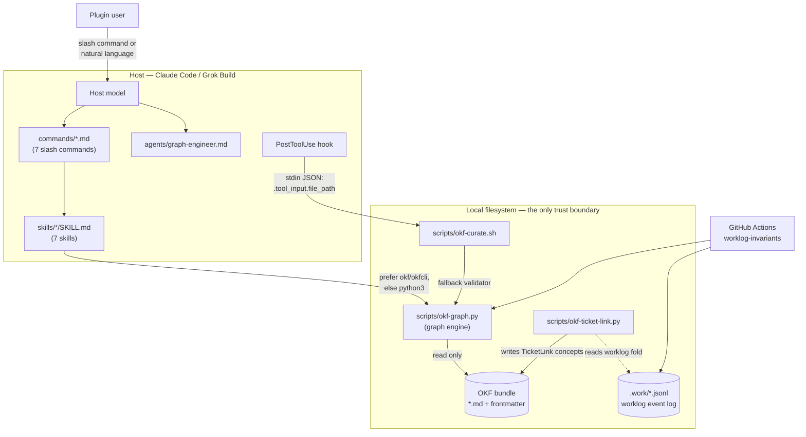
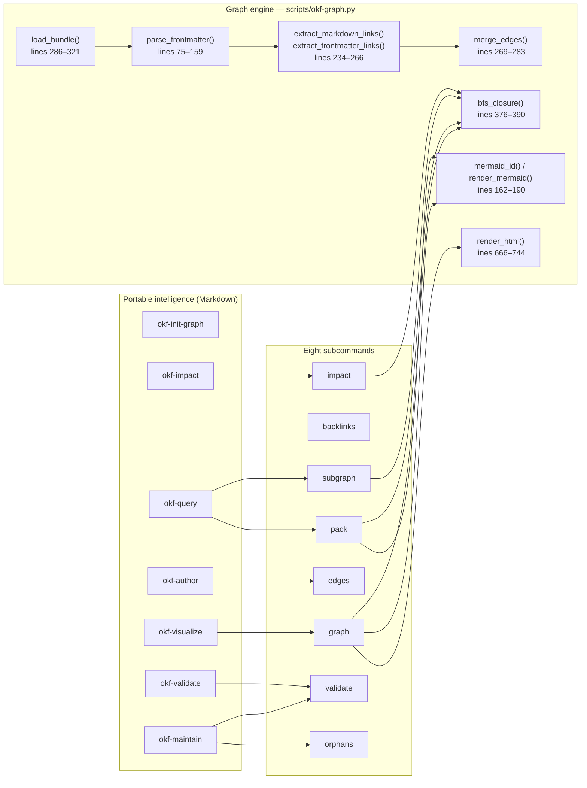
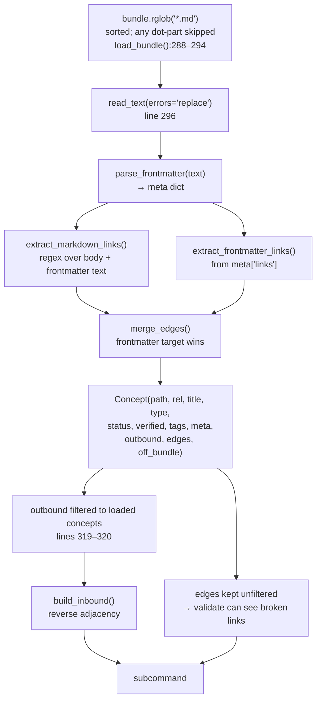
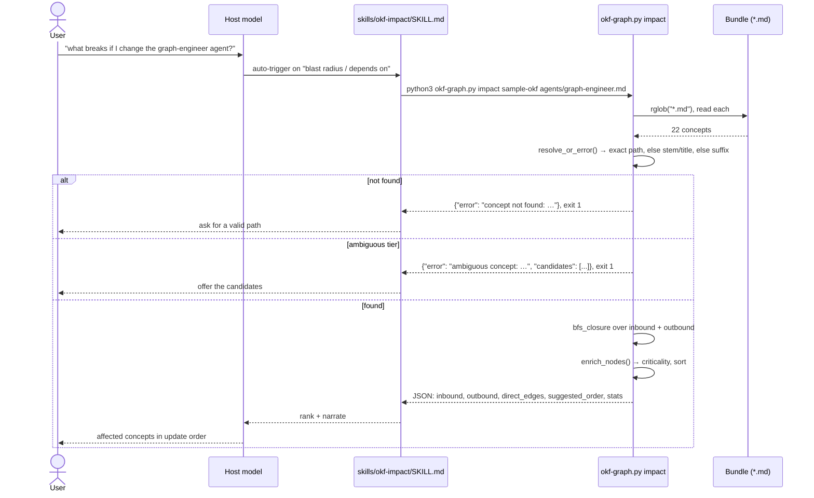
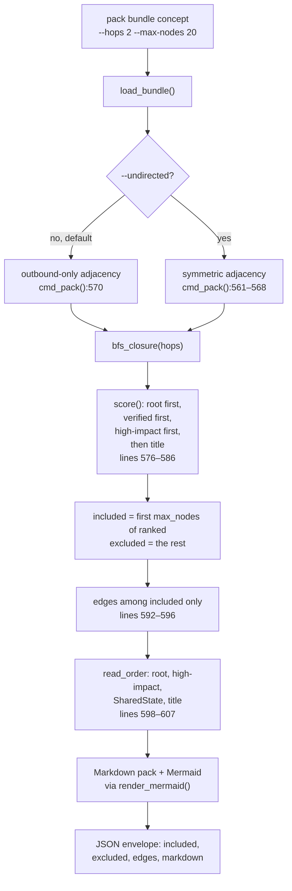
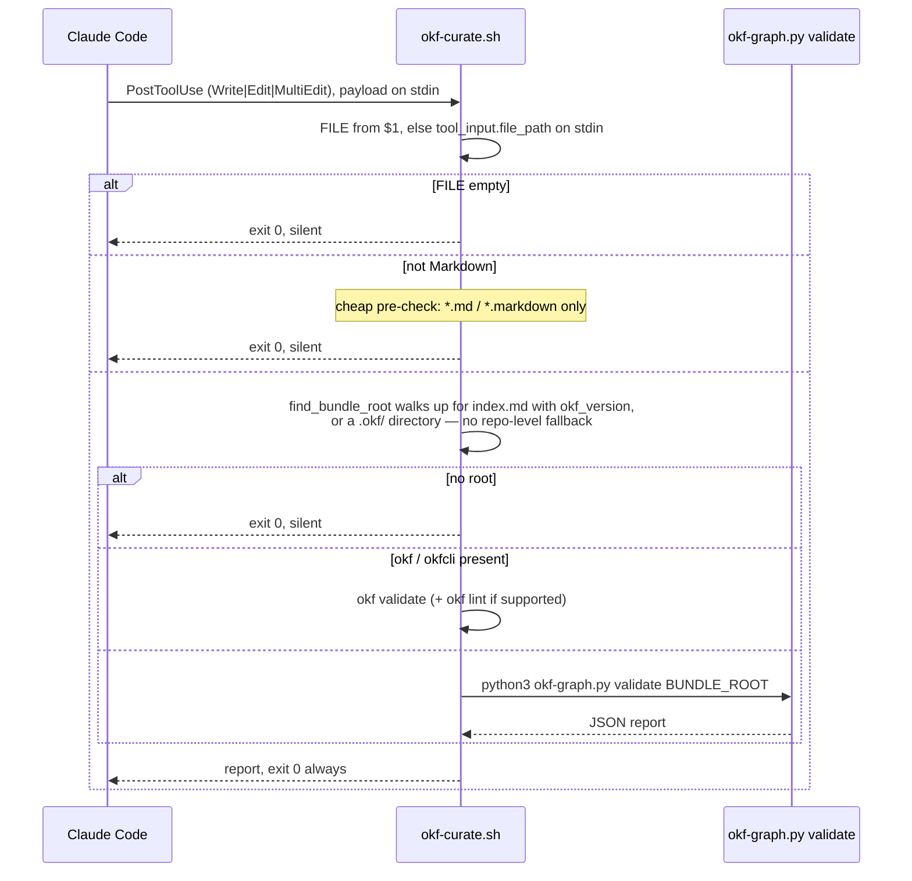
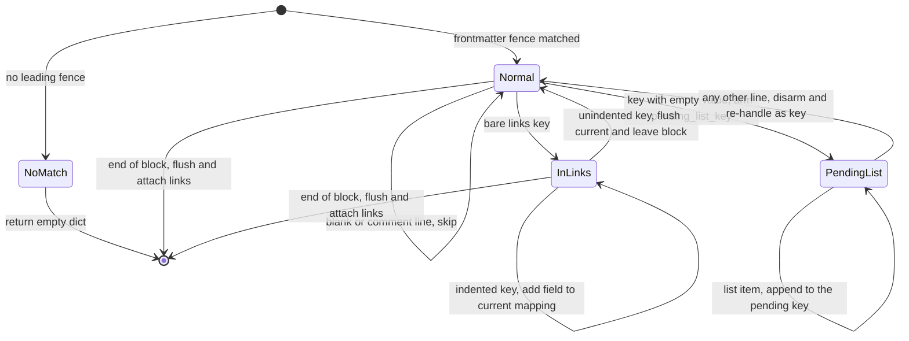
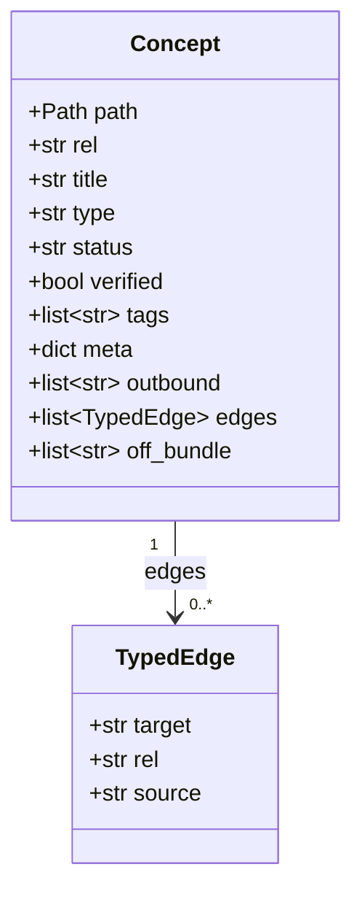
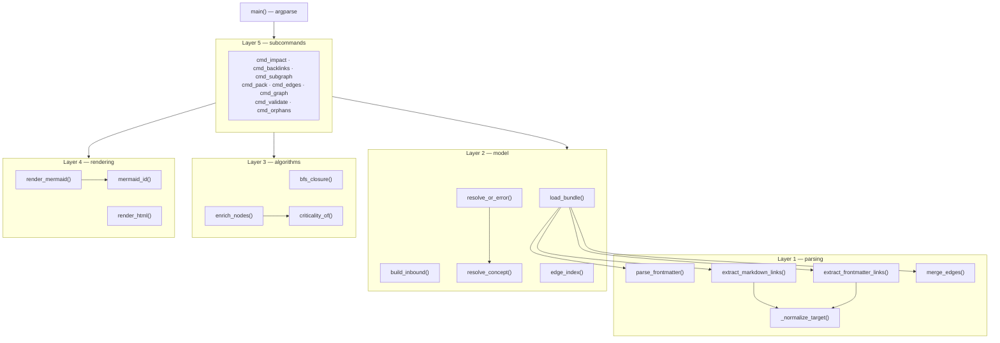

# OKF Graph Engineering Plugin — Design Document

> Generated against the v0.3.2 tag. Every code claim below cites
> `path — symbol(), lines N–M` and was read from the tree at
> `f59655a`. Claims are labelled **Confirmed** (read in the code),
> **Assumption**, **Recommendation**, or **Open Question**.
>
> **What changed since the v0.3.1 edition.** One behaviour change, in
> `cmd_validate()`: the bundle's root `index.md` and `log.md` used to `continue`
> past the entire per-concept loop, so the bundle's most linked-from file was
> the one place a broken link went unreported. The exemption is now scoped to
> the two metadata checks it was always meant to cover (§13). One repo-tooling
> change came with it: `tests/test_okf_curate.sh` is now on both gates, which
> closes R10 (§18.2, §20). Everything else in v0.3.2 is release chore.

---

# 1. Document Overview

**Purpose.** Describe what `okf-graph-eng` is, how it is built, and what a
developer must understand before changing it.

**Audience.** Contributors to this repository, and plugin users who need to know
what the tooling guarantees.

**Scope.** The plugin surface (`.claude-plugin/`, `skills/`, `commands/`,
`agents/`, `hooks/`), the graph engine (`scripts/okf-graph.py`), the two
auxiliary scripts, the worked example (`sample-okf/`), and the CI/hook gates that
protect them.

**Out of scope.** The vendored WikiTicket SDD / worklog tooling under `bin/` and
`.work/` is project-management plumbing, orthogonal to the plugin's logic. It is
described only where the plugin depends on it (§15, §28).

## 1.1 Definitions

| Term | Meaning |
|---|---|
| **OKF** | Open Knowledge Format — knowledge as Markdown files with YAML frontmatter, linked by Markdown links |
| **Bundle** | A directory tree of OKF Markdown with a root `index.md` carrying `okf_version` |
| **Concept** | One `.md` file in a bundle; a node in the graph |
| **Typed edge** | A link that carries a relation name (`depends_on`, `routes_to`, …) rather than a bare hyperlink |
| **Knowledge graph** | Concepts describing a domain (Dataset, Metric, Reference, …) |
| **Agent graph / harness graph** | Concepts describing the automation itself (AgentNode, Workflow, SharedState, …) |
| **Dual graph** | Both of the above in one bundle — the plugin's core premise |
| **Progressive disclosure** | Shipping a bounded, ranked subgraph ("pack") instead of a whole tree |
| **Blast radius / impact** | The transitive set of concepts affected by changing one concept |

## 1.2 Related documents

- [Code Walkthrough](/docs/designs/2026-08-03_v0.3.2-release_code_walkthrough.md) — the guided tour of the same code
- [CLI Reference](/docs/user_guide/cli-reference.md)
- [User Guide](/docs/user_guide/user-guide.md) · [Plugin Guide](/docs/user_guide/plugin-guide.md)
- [CHANGELOG](/CHANGELOG.md) · [Roadmap](/docs/roadmap.md)
- Plan: [v0.3.0 — fix the plumbing, add the net](/docs/plans/2026-08-01-v030-plumbing-and-tests.md)
- Plan: [v0.3.1 — correctness and traceability](/docs/plans/2026-08-02-v031-correctness-and-traceability.md)

---

# 2. Executive Summary

**What it is.** `okf-graph-eng` is a Claude Code plugin that turns a directory of
Markdown into a queryable graph, so an agent can answer "what breaks if I change
this?" and "what is the smallest set of documents you need to read?" without
loading the whole tree.

**Business problem.** Agent context is finite and expensive. Documentation trees
are neither structured nor bounded. The plugin makes the structure explicit
(typed edges), then uses it to bound what gets read.

**Two graphs, one bundle.** The differentiator is that the same mechanism models
the *domain* (datasets, metrics, references) and the *harness* (agents,
workflows, shared state). Asking for the blast radius of an `AgentNode` is the
same operation as asking for the blast radius of a `Table`.

**Major components.**

| Component | What it is |
|---|---|
| Seven skills (`skills/*/SKILL.md`) | The portable intelligence — Markdown instructions the host model follows |
| Seven slash commands (`commands/*.md`) | Thin wrappers so a user can type `/okf-impact` |
| One agent (`agents/graph-engineer.md`) | Specialist subagent for multi-hop graph work |
| Graph engine (`scripts/okf-graph.py`, 989 lines) | Deterministic CLI: eight subcommands over a bundle |
| Post-edit hook (`hooks/hooks.json` → `scripts/okf-curate.sh`) | Validates the touched bundle after every Write/Edit/MultiEdit |
| `sample-okf/` | 22-concept, 83-edge self-describing bundle used as a worked example *and* a CI tripwire |
| `tests/test_okf_graph.py` | 25 plain-assert cases over the engine |
| `tests/test_okf_curate.sh` | 5 checks over the curation hook — the repo's first shell test (added in v0.3.1, gated in v0.3.2) |

**External dependencies.** Python 3 and Bash — nothing else at runtime.
**Confirmed:** `scripts/okf-graph.py` imports only the standard library
(`argparse`, `html`, `json`, `re`, `sys`, `collections`, `dataclasses`,
`datetime`, `pathlib`, `typing` — lines 17–26). No package manifest, no lockfile,
no install step.

**Key architectural decisions.** Package once as a Claude Code plugin and let
Grok Build read it natively (§6.1). Keep Markdown links canonical and treat
frontmatter typed edges as enrichment (§6.2). Ship a hand-rolled frontmatter
parser rather than depend on PyYAML (§6.3). Default the validator to lenient and
gate CI with `--strict` (§6.4). New in v0.3.1: refuse an ambiguous concept query
rather than guess (§6.8), and report a link that escapes the bundle instead of
dropping it (§6.9). New in v0.3.2: a structural file is excused from the *type
and title* checks only — never from link validation (§6.10).

**Primary risks.** The frontmatter parser is a hand-rolled approximation of YAML
and will mis-handle constructs it has never seen (§20 R1). The `sample-okf`
concept/edge counts are asserted as literals in the test suite, so any
legitimate edit to the sample fails CI until the numbers are updated (§20 R3).
Four of eight subcommand payloads still have no direct shape test (§20 R2).

---

# 3. Requirements Summary

Derived from `README.md`, `CLAUDE.md`, `docs/plans/2026-08-01-v030-plumbing-and-tests.md`,
and the `CHANGELOG.md` release notes.

## 3.1 Functional

| # | Requirement | Where satisfied |
|---|---|---|
| F1 | Compute transitive impact (inbound + outbound) of a concept | `scripts/okf-graph.py — cmd_impact(), lines 441–481` |
| F2 | List direct inbound references to a concept | `cmd_backlinks(), lines 484–502` |
| F3 | Extract an N-hop neighborhood | `cmd_subgraph(), lines 505–545` |
| F4 | Emit a bounded, ranked context pack | `cmd_pack(), lines 548–648` |
| F5 | List edges, filterable by source concept and relation | `cmd_edges(), lines 651–663` |
| F6 | Render the graph as Mermaid, JSON, or standalone HTML | `cmd_graph(), lines 747–818` |
| F7 | Validate structure, links, and graph hygiene | `cmd_validate(), lines 820–900` |
| F8 | Report disconnected concepts | `cmd_orphans(), lines 900–910` |
| F9 | Support typed edges without breaking plain Markdown links | `merge_edges(), lines 269–283` |
| F10 | Bridge worklog items / GitHub issues into the graph as `TicketLink` concepts | `scripts/okf-ticket-link.py — emit(), lines 114–195` |
| F11 | Curate automatically after an agent edits a bundle | `hooks/hooks.json` + `scripts/okf-curate.sh` |
| F12 | Work in Claude Code and Grok Build from one package | `.claude-plugin/plugin.json`, `.grok-plugin/marketplace.json` |

## 3.2 Non-functional

| # | Requirement | Where satisfied |
|---|---|---|
| N1 | Zero runtime dependencies beyond `python3` + `bash` | stdlib-only imports, `scripts/okf-graph.py:17–26` |
| N2 | Portable across macOS and Linux without coreutils | `okf-curate.sh` fallback uses `okf-graph.py`, not `realpath -m` (lines 69–72) |
| N3 | Every subcommand is scriptable | JSON on stdout for six of eight; `graph` prints the artifact by design (`cmd_graph()` docstring, lines 748–756) |
| N4 | HTML output must open offline and inside a locked-down viewer | `render_html(), lines 666–744`; asserted by `tests/test_okf_graph.py — test_graph_html_is_self_contained(), lines 287–301` |
| N5 | The graph engine is covered by tests that run in CI | `.github/workflows/worklog.yml`, "graph engine tests" step |
| N6 | The plugin version cannot drift across its four manifests | `test_version_is_consistent_across_manifests(), lines 404–421` |
| N7 | Skills must keep working when the validator emits warnings | `cmd_validate()` returns 0 on warnings unless `--strict`, lines 898–900 |

**Omitted NFR classes:** availability, scalability, disaster recovery, data
retention and compliance — there is no service, no tenancy, and no hosted data.
The tool is a local CLI over files in a git repository.

---

# 4. System Context

**Actors.**

- **Plugin user** — a developer in Claude Code or Grok Build who types
  `/okf-impact` or asks a question that triggers a skill.
- **Host model** — Claude Code / Grok Build. It reads `SKILL.md` files and
  decides when to shell out to the CLI.
- **Post-edit hook** — the host, acting automatically after each file write.
- **CI** — GitHub Actions, running the same checks non-bypassably.

**Trust boundaries.** One: the local filesystem. The graph engine reads `*.md`
under a bundle root and writes nothing. The only outbound network call in the
repository is `scripts/substack_okf.py — http_get(), lines 77–97`, and that
script is a local integration harness, not part of the plugin surface (§20).



**How to read it.** Everything above the `Local` box is instructions the host
model interprets; everything inside it is deterministic code. The plugin's
working rule (`CLAUDE.md`, "Deterministic tools first") is exactly this boundary:
prose decides *when*, code decides *what*.

**Failure behavior.** If `okf`/`okfcli` is absent the skills fall back to
`python3 scripts/okf-graph.py` (`skills/okf-impact/SKILL.md` and siblings). If
`okf-curate.sh` cannot find a bundle root it exits 0 *silently*
(`scripts/okf-curate.sh:52–57`) — curation never blocks an edit, and since
v0.3.1 the hook reaches that point on every Markdown edit in every repository,
so it must not narrate the non-event.

---

# 5. High-Level Architecture

## 5.1 Logical architecture



**How to read it.** Every subcommand goes through the same ingest pipeline —
`load_bundle()` is called first in all eight (`cmd_impact():442`, `cmd_backlinks():485`,
`cmd_subgraph():506`, `cmd_pack():555`, `cmd_edges():652`, `cmd_graph():757`,
`cmd_validate():821`, `cmd_orphans():903`). There is no cache and no incremental
mode: each invocation re-reads the bundle from disk. For a bundle of a few
hundred files this is milliseconds; see §20 R5.

**Confirmed:** `render_mermaid()` is shared by exactly two callers — `cmd_pack()`
line 627 and `cmd_graph()` line 801. It was extracted in v0.3.0 so the pack
diagram and the standalone graph diagram cannot drift apart.

## 5.2 Data flow — one invocation



**The load-bearing subtlety.** `Concept.outbound` is pruned to targets that
actually exist, but `Concept.edges` is not (`load_bundle():316–320`). Traversal
therefore never walks into a void, while `cmd_validate()` can still report the
dangling target as a broken link (`cmd_validate():841–843`). Conflating the two
lists would either crash the BFS or blind the validator.

**A third list, new in v0.3.1.** `Concept.off_bundle` (lines 70–72) holds the
raw targets that resolved *outside* the bundle root. They are still not edges —
nothing traverses them — but they are no longer discarded either.
`_normalize_target()` appends to the collector on the `relative_to()` failure
path (lines 225–228), `load_bundle()` threads one list per concept through both
extractors (lines 298–300), and `cmd_validate()` reports each as
`link outside bundle → …` at severity **warn** (lines 835–840). The prior
behaviour meant a mistyped `../../` was invisible rather than broken.

**Dot-directories are skipped, matched on bundle-relative parts** (lines
288–294). Before v0.3.1 only dot-*files* were skipped, so pointing the engine
at a repository root pulled `.git/`, `.work/` and `.claude/` in as concepts.
Matching on `path.relative_to(bundle).parts` rather than the absolute path is
deliberate: a bundle that itself lives under a dot-directory still loads.

## 5.3 Runtime and deployment

There is no runtime to deploy. Installation is a marketplace entry pointing at
this repository (`marketplace.json`, `.claude-plugin/marketplace.json`,
`.grok-plugin/marketplace.json`). The host clones or links the tree and resolves
intra-plugin paths through `${CLAUDE_PLUGIN_ROOT}` — used by `hooks/hooks.json:9`
and by every `commands/*.md` file (v0.3.0 fixed bare relative paths that did not
resolve from a consuming project; see CHANGELOG "Fixed").

---

# 6. Architectural Decisions

## 6.1 One Claude Code plugin, two hosts

**Decision.** Ship a single Claude Code plugin; do not maintain Grok-specific
packaging beyond a thin marketplace pin.
**Context.** Grok Build reads Claude plugins, skills, agents, and hooks natively.
**Alternatives.** Separate Grok package (drift risk); Grok-only features (breaks
Claude).
**Consequences.** One install path, two hosts. No feature may depend on a
Grok-only capability.
**Recorded as an in-repo ADR:** `sample-okf/decisions/single-claude-plugin.md`
(status: accepted, verified: true). `docs/adr/` exists but is empty — the
decision records live in the sample bundle, which is itself the plugin's
self-description.

## 6.2 Markdown links are canonical; typed edges enrich

**Decision.** A plain `[Title](/path.md)` link is a real edge with relation
`links_to`. Frontmatter `links: [{target, rel}]` entries add a relation name.
**Implementation.** `merge_edges(), lines 269–283` — frontmatter wins for the
same target, so a concept can upgrade a prose link to `depends_on` without
duplicating it.
**Rationale.** A bundle stays readable and useful in any Markdown viewer; typing
is optional and additive.
**The precedence is unconditional, and v0.3.1 made that visible.** Until then
the loop carried a three-clause guard — `prev is None or prev.rel == "links_to"
or e.source == "frontmatter"` — that read like a comparison of relations but
could not decide anything: `extract_markdown_links()` only ever emits
`links_to` (line 247) and every `fm_edge` has `source == "frontmatter"` by
construction (line 265), so all three clauses were true for every frontmatter
edge. The guard was deleted and the docstring now states the reason (lines
270–277). Behaviour is unchanged; only the appearance of conditionality is
gone.
**Tradeoff.** Two edge sources means two parsers and a merge rule to keep
correct. Covered by `test_merge_edges_frontmatter_wins(), lines 89–94` and, for
the non-overlapping case, `test_merge_edges_keeps_markdown_only_targets(),
lines 96–119`.
**Revisit if:** relations ever need attributes beyond a name (weight, direction,
validity window) — a dict-per-edge merge would no longer suffice.

## 6.3 A hand-rolled frontmatter parser instead of PyYAML

**Decision.** Parse frontmatter with a line-oriented state machine
(`parse_frontmatter(), lines 75–159`).
**Rationale.** PyYAML is not in the standard library. Requiring it would turn a
copy-the-file plugin into a package with an install step, on two hosts.
**Tradeoff.** It is not YAML. It handles scalars, booleans, inline lists
(`[a, b]`), block sequences (`- a` under a bare key), and the `links:` list of
mappings — and nothing else. Nested maps, multi-line scalars, anchors, and
comments-after-values are unsupported.
**History.** v0.2.0 shipped without block-sequence support: `tags:` followed by
`- item` returned `''`, which `load_bundle()`'s `isinstance` guard (line 309)
then coerced to `[]` with no warning. Every generator in this repo emits inline
lists, so `sample-okf` looked clean and only user-authored bundles were affected.
Fixed in v0.3.0 by the `pending_list_key` mechanism (lines 86, 124–133) and
pinned by `test_frontmatter_block_sequence(), lines 47–56`.
**Revisit if:** users start hitting the parser's edges. The honest upgrade is an
optional PyYAML path with this parser as the fallback.

## 6.4 Lenient by default, `--strict` for CI

**Decision.** `validate` exits 0 on warnings; `--strict` makes warnings
non-zero (`cmd_validate(), lines 898–900`).
**Rationale.** The skills call `validate` mid-conversation and treat non-zero as
failure. A bundle with an unverified `AgentNode` is not broken — it is
in-progress. CI, however, needs warnings to actually gate.
**Consequence.** The one place strictness is applied is
`.github/workflows/worklog.yml` ("sample bundle stays valid"). The post-edit hook
deliberately uses the lenient default (`okf-curate.sh:72`).
**Pinned by:** `test_strict_validate_flags_warnings(), lines 383–402`.

## 6.5 Mermaid node ids derive from the full relative path

**Decision.** `mermaid_id(rel)` sanitizes the whole path, not the stem
(lines 162–171).
**Context.** v0.2.0 derived ids from `Path(rel).stem`, so all seven `index.md`
files in `sample-okf` collapsed into one node and `agents/foo.md` merged with
`docs/foo.md`.
**Rationale.** Path is the concept's identity everywhere else in the engine
(dict keys in `load_bundle()`, edge endpoints, `resolve_concept()` output). The
renderer had been the only component using a different identity.
**Pinned by:** `test_mermaid_ids_are_unique_per_path(), lines 146–158`.

## 6.6 `graph` prints its artifact; every other subcommand prints JSON

**Decision.** `--format mermaid|html` write the raw artifact to stdout;
`--format json` writes JSON.
**Rationale, quoted from `cmd_graph()` lines 751–755:** "a rendered graph is the
only product here, so wrapping it would force every caller through `jq -r`
before it could be pasted into a doc or written to a file."
**Contrast with `pack`,** whose JSON envelope carries `included` / `excluded` /
`edges` *alongside* its `markdown` byproduct (`cmd_pack():638–646`) — there the
structured data is the point and the Markdown is a convenience.
**Tradeoff.** One subcommand breaks the "always JSON" uniformity. Callers must
know which mode they are in. Documented in the CLI reference and in `--help`.

## 6.7 The HTML map is self-contained by construction

**Decision.** `render_html()` emits one file with inlined CSS, no `<script>`, no
`src=`, no `@import`, no `url()`, no `http(s)://` (lines 666–744).
**Rationale, quoted from the docstring (lines 673–677):** "No CDN, no JS, no
network fetches — the file must open from disk and from a locked-down viewer.
Renderers that understand `pre.mermaid` draw the diagram; everywhere else the
tables carry the same information."
**Consequence.** The diagram degrades to two tables rather than to nothing. This
is a security property as much as a portability one (§22).
**Pinned by:** `test_graph_html_is_self_contained(), lines 287–301`, which
asserts each forbidden token is absent.

## 6.8 An ambiguous concept query is an error, not a guess (v0.3.1)

**Decision.** `resolve_concept()` resolves in tiers and returns
`(match, candidates)`; a tier that matches more than one concept yields
`(None, candidates)` and the caller exits 1 with the candidate list
(`resolve_concept(), lines 333–357`; `resolve_or_error(), lines 360–373`).
**Context.** The prior implementation was a single loop that returned the first
concept matching a stem, a title, *or* a path suffix — first match wins in
`dict` iteration order. Two concepts named `page.md` in different directories
meant `impact` and `pack` answered about whichever sorted earlier, with nothing
to say they had chosen.
**Why tiers rather than one flat set.** Specificity has an obvious ordering:
an exact bundle-relative path is unambiguous by construction; a stem or title
match is a deliberate shorthand; a suffix match is the loosest. Collapsing them
would make `only.md` ambiguous against `a/only.md` — a false positive on the
common case. Each tier is only consulted if the previous one found nothing.
**Alternatives considered.** (a) Leave it — rejected, silent wrongness is the
one failure mode this tool cannot afford. (b) Warn and proceed — rejected, the
JSON payload has no warning channel and the caller would have to parse for one.
(c) Prefer exact and warn otherwise — this is (b) with extra steps.
**Consequences.** Full paths, which every skill passes, are unaffected: the
`q in concepts` fast path returns before any tier runs. Ambiguity rides the
existing not-found path — same exit code, same `{"error": …}` shape, plus a
`candidates` key — so no caller needed changing.
**Confirmed:** `resolve_or_error()` replaced an identical four-line
error-and-return block in six `cmd_*` functions: `cmd_impact():445–447`,
`cmd_backlinks():487–489`, `cmd_subgraph():507–509`, `cmd_pack():557–559`,
`cmd_edges():655–657`, `cmd_graph():762–764`.
**Pinned by:** `test_resolve_concept_reports_ambiguity(), lines 161–181` (unit)
and `test_ambiguous_concept_is_a_cli_error(), lines 303–321` (all four
concept-taking subcommands, end to end).

## 6.9 A link that escapes the bundle is reported, not dropped (v0.3.1)

**Decision.** Keep the rule that an off-bundle target is not an edge, but
record the raw target and report it from `validate` at severity **warn**.
**Context.** `_normalize_target()` returned `None` on the `relative_to()`
`ValueError`, which is correct for traversal — an edge to a file outside the
graph is meaningless — but meant a mistyped `../../` produced *nothing at all*:
no edge, no broken-link error, no note. The link simply did not exist.
**Why warn and not error.** The exit-code contract from §6.4 applies: the
skills and `okf-curate.sh` call `validate` with the lenient default and read
non-zero as failure. An off-bundle link is a probable typo, not a corrupt
bundle. `--strict` gates it in CI, which is where it should bite. The comment
above the check says exactly this (lines 835–836).
**Mechanism.** An optional `off_bundle: list[str] | None` collector parameter
threaded through `_normalize_target()`, `extract_markdown_links()`, and
`extract_frontmatter_links()` — optional so every existing call site and the
unit tests keep working unchanged. `load_bundle()` passes one list per concept
and stores it on `Concept.off_bundle`.
**Tradeoff.** A fourth parameter on three parsing functions to carry one
diagnostic. The alternative — returning a richer type from `_normalize_target()`
— would have touched every caller for the same information.
**Pinned by:** `test_validate_reports_off_bundle_links(), lines 323–345`, which
covers both a Markdown link and a frontmatter link, asserts the default exit
stays 0, and asserts `--strict` returns 1.

## 6.10 A structural file is excused from metadata, never from links (v0.3.2)

**Decision.** `cmd_validate()`'s per-concept loop excuses the root `index.md`,
any nested `index.md`, and the root `log.md` from the `type` and `title`
warnings — and from nothing else. A single `structural` boolean gates exactly
those two checks (`cmd_validate(), lines 826–834`).

**Context.** The loop used to open with `if rel in ("index.md", "log.md"):
continue`. The intent was the metadata exemption; the effect was a full skip.
Broken-link detection, off-bundle reporting, the non-standard-rel `info`, and
`TicketLink` hygiene all ran *after* that line, so the bundle's entry point —
its most linked-from file, and the one every skill and every reader starts from
— was the single place in the bundle where a broken link was never reported. A
tool whose product is an assertion about what depends on what had a blind spot
at the root of the dependency tree.

**Why the fix is smaller than it looks.** Both metadata checks already carried
their own `c.path.name != "index.md"` guard, so the `continue` added nothing for
any `index.md`. And `load_bundle()` assigns `index.md` the type `Index` when
frontmatter supplies none (`load_bundle():306`), so the type check could not
fire for it in the first place. The only file that genuinely needed the broad
`continue` was the bundle's root `log.md`, which carries no frontmatter at all.
Hoisting `structural` restated that one real exemption and deleted the
accidental one. **Assumption:** an `index.md` whose frontmatter sets `type:
Unknown` explicitly would now still be excused — the `structural` test is by
filename, exactly as the old name guard was, so the corner case is unchanged.

**Scope.** `structural` is per-file-name for `index.md` (any depth) and
root-relative for `log.md` (`rel == "log.md"`), which preserves the previous
behaviour of a *nested* `log.md`: it is an ordinary concept and still owes a
type and a title. The separate orphan exemption at `cmd_validate():866–867` is
untouched — a root index or log is still never reported as an orphan.

**Tradeoff.** None material. The rewrite is +9/−6 lines, three of which are the
comment explaining why the exemption is narrow, so the fix is a net *addition*
of three lines rather than the deletion it is sometimes described as. The
executable content is a wash: six lines out, six lines in.

**Pinned by:** `test_root_index_and_log_have_their_links_validated(), lines
347–369`, which asserts the root `index.md` and `log.md` both report broken
links, that the root `index.md` reports an out-of-bundle link, and — in the same
bundle — that only a *nested* `log.md` earns a "missing title" warning.

---

# 7. Component Inventory

| Component | Type | Responsibility | Inputs | Outputs | Depends on | Failure impact |
|---|---|---|---|---|---|---|
| `skills/*/SKILL.md` (7) | Markdown instructions | Tell the host model when and how to do graph work | User intent | Tool calls, prose | Graph engine (optional) | Model falls back to ad-hoc reasoning |
| `commands/*.md` (7) | Slash-command wrappers | Give each skill an explicit entry point | `$ARGUMENTS` | Delegation to a skill | `${CLAUDE_PLUGIN_ROOT}` | Slash command unavailable; skill still auto-triggers |
| `agents/graph-engineer.md` | Subagent definition | Multi-hop graph work in an isolated context | Task prompt | Report | Skills + engine | Main thread does the work inline |
| `scripts/okf-graph.py` | Python CLI, 989 lines | All deterministic graph operations | Bundle path, concept path, flags | JSON / Mermaid / HTML | stdlib only | Every skill degrades to manual file crawling |
| `scripts/okf-curate.sh` | Bash, 75 lines | Post-edit validation of the touched bundle | `$1` or PostToolUse stdin JSON | stdout report | `python3`, `okf-graph.py` | Silent drift after agent edits |
| `scripts/okf-ticket-link.py` | Python CLI, 220 lines | Render worklog items / GitHub issues as `TicketLink` concepts | `worklog fold` JSON or flags | `<bundle>/tickets/*.md` + index | worklog (optional) | Tickets absent from the graph |
| `scripts/substack_okf.py` | Python CLI, 917 lines | Local end-to-end integration harness (§20) | Substack archive API | Gitignored bundle under `integration/` | network, `okf-graph.py` | No end-to-end signal; unit tests unaffected |
| `hooks/hooks.json` | Host hook config | Bind PostToolUse → curate | Write/Edit/MultiEdit events | Command invocation | `${CLAUDE_PLUGIN_ROOT}` | Curation never runs (this was the v0.2.0 defect) |
| `sample-okf/` | 22 concepts, 83 edges | Worked example *and* CI drift tripwire | — | — | — | Demos break; CI fails loudly |
| `tests/test_okf_graph.py` | 25 plain-assert cases | Regression net for the engine | — | Exit code | `okf-graph.py`, `sample-okf`, 4 manifests | Regressions ship silently (the v0.2.0 condition) |
| `tests/test_okf_curate.sh` | 5 bash checks | Regression net for the curation hook | — | Exit code | `okf-curate.sh`, `okf-graph.py` | Hook defects ship silently again — on CI and pre-commit since v0.3.2 |
| `hooks/pre-commit`, `hooks/commit-msg` | Git hooks (vendored worklog) | Log invariants, roadmap freshness, graph tests, ULID in message | Staged tree | Exit code | `bin/`, `python3` | Bad commits reach the branch; CI still catches them |

---

# 8. End-to-End Workflows

## 8.1 Impact-first change (the primary flow)

**Trigger.** User asks "what depends on X?" or is about to edit a high-impact
concept. `CLAUDE.md` working rule 2 makes this mandatory before structural edits
to `AgentNode`, `Workflow`, or `SharedState`.



**Main flow (cited).** `cmd_impact(), lines 441–481`: load (376) → build reverse
adjacency (377) → resolve (379) → BFS both directions (383–384) → collect direct
typed edges in and out (386–395) → emit payload (396–415).

**Failure flows.** Unresolvable *or ambiguous* concept → `{"error": …}` and
exit 1 (445–447, via `resolve_or_error()`). Broken outbound links are invisible
here: `outbound` was pruned at load
(`load_bundle():319–320`), which is why `validate` is the tool that reports them.

**Idempotency / state.** Read-only. No writes, no retries, no timeouts.

**`suggested_order` is inbound-only** (line 407) — the things that *reference*
the target, ordered by criticality then depth then title (`enrich_nodes():428–429`).
Callers wanting a full ordering must merge in `outbound` themselves. **Confirmed**
by reading the field construction; the field name does not make this obvious.

## 8.2 Progressive-disclosure pack

**Trigger.** A long-running agent needs context on a concept without reading the
tree. `/okf-query` or the `okf-query` skill.



**Why outbound-only is the default.** Quoted from `cmd_pack()` lines 550–553:
"Outbound-only keeps packs inside a theme (e.g. group → members) instead of
flooding through hub catalogs that link everything." A bundle's `index.md` links
to everything; an undirected 2-hop walk from any leaf reaches the index and then
the entire bundle. `--undirected` exists for deliberate neighborhood exploration
(`main():932–936`).

**Two different orderings, deliberately.** `score()` (576–586) decides *what
survives the cut*; `read_order` (598–607) decides *what order the survivor list is
presented in*, and additionally promotes `SharedState`. They are not the same
sort and should not be collapsed.

**Unverified high-impact concepts are flagged inline** in the Markdown with
`⚠ unverified high-impact` (lines 621–623) rather than dropped — the reader is
told the node is untrusted, not denied it.

**Truncation is disclosed, never silent:** up to 15 excluded titles are listed,
then "… and N more" (lines 630–635).

## 8.3 Visualization

**Trigger.** `/okf-visualize`, or a request for a diagram or an HTML map.

`cmd_graph(), lines 747–818`. Without `--focus`, nodes are every concept
(`sorted(concepts)`, line 759). With `--focus`, an undirected neighborhood BFS
bounded by `--hops` (761–771). Edges are then restricted to pairs where both
endpoints survived (line 774).

**The isolated-node repair.** `render_mermaid()` only declares nodes it sees on
an edge. `cmd_graph()` therefore appends a node line for every unlinked concept
(lines 801–808), with the reason in the comment: "isolated concepts would
otherwise disappear from the diagram but stay in the JSON view." This was a
v0.3.0 fix; `test_graph_mermaid_is_a_fenced_block(), lines 237–245` asserts every
node from the JSON view appears in the Mermaid view.

**`--hops` is reported as `null` when there is no focus** (line 782) — hops are
meaningless for a whole-bundle render, and `test_graph_json_shape(), line 251`
asserts it.

## 8.4 Post-edit curation (the automation path)



**The v0.2.0 defect, in full.** `hooks/hooks.json` passed `"$FILE_PATH"`, but the
host delivers the PostToolUse payload as JSON on stdin — there is no such
environment variable. `okf-curate.sh` bound an empty string and hit its first
guard on every edit. The hook had never run in any install. It now reads
`.tool_input.file_path` from stdin (`okf-curate.sh:9–16`), and the matcher covers
`MultiEdit`, which previously bypassed curation entirely (`hooks/hooks.json:5`).

**Why `python3` and not `jq`** — stated in the comment at lines 6–8: "the plugin
already requires python3 everywhere, jq is not guaranteed present."

**The hook never fails a build.** Every branch exits 0, and each validator call
is suffixed `|| true` (lines 62, 64, 67, 72). Curation reports; it does not block.

**The v0.3.1 restructure: membership is decided by one test, not two.** The
pre-filter used to be `*.okf/*|*/.okf/*|*knowledge/*|*sample-okf/*` — a list of
path fragments standing in for a bundle test. A bundle rooted anywhere else was
skipped outright, which stopped mattering only because the hook had never fired
at all before v0.3.0. Three things changed together (`okf-curate.sh`):

| Before | After | Why |
|---|---|---|
| `case` on four path fragments (old lines 22–25) | `case "$FILE" in *.md\|*.markdown)` (lines 26–29) | The only cheap fact worth checking is that OKF bundles are Markdown. Everything else needs a filesystem walk, and `find_bundle_root` already does it |
| `find_bundle_root` fell back to the repo's `.okf/`, then `sample-okf/` (old lines 42–52) | walk-up only; `return 1` when nothing is found (lines 35–50) | A file outside every bundle must not be curated against an unrelated one just because the repo ships a bundle somewhere |
| `echo "no OKF bundle root found for $FILE — skipping"` | silent `exit 0` (lines 52–57) | With the filter widened to all Markdown, every `.md` edit in every repo now reaches this line. A hook must not narrate non-events |

**Confirmed** by `tests/test_okf_curate.sh`: a bundle at `$TMP/my-graph/`
— not `.okf/`, not `knowledge/`, not `sample-okf/` — is curated (check 1, via
`$1`; check 3, via the stdin payload); a Markdown file outside any bundle
produces no output (check 2); malformed stdin is a no-op (check 4); a `.py`
file *inside* a bundle is rejected by the pre-check (check 5). This closes the
v0.3.0 edition's R4.

## 8.5 TicketLink emission

`scripts/okf-ticket-link.py — emit(), lines 114–195`. Reads `bin/worklog fold`
JSON from stdin (or `--worklog-fold`, or a single `--id`), maps worklog status to
ticket status (`status_map(), lines 32–39`), renders one `TicketLink` concept per
item into `<bundle>/tickets/<slug>.md`, and rewrites `tickets/index.md` including
pre-existing entries it did not just write (lines 184–191). `--dry-run` reports
paths without writing (159–161); `--open-only` skips done and cancelled (125–126).

**Idempotency.** Re-running overwrites by slug. A retitled item produces a new
file and leaves the old one — **Confirmed** by reading lines 147–163, which
derive the filename from the current title with no cleanup of prior slugs.

---

# 9. Complex Business Logic

## 9.1 The frontmatter parser state machine

This is the most intricate logic in the repository and the source of a shipped
defect, so it gets a state diagram.



**Decision table — value coercion** (`parse_frontmatter(), lines 135–153`):

| Input after `key:` | Result | Line |
|---|---|---|
| *(empty)* | `""`, and `pending_list_key = key` | 137–140 |
| `true` / `false` (any case) | Python `bool` | 142–143 |
| `[a, b]` | `list[str]`, quotes and whitespace stripped | 144–148 |
| `[]` | `[]` | 146–147 |
| anything else | `str`, outer `"` or `'` stripped | 149–150 |

**Edge cases.**

- A bare key followed by *no* list keeps `""` (comment, line 132: "no list
  materialized; the bare key keeps its empty-string value"). `load_bundle()`'s
  `isinstance(..., list)` guard at line 309 then yields `[]` for `tags`.
  **Confirmed** — and this is precisely the path that hid the v0.2.0 bug.
- A line with no `:` outside a list context is skipped entirely (line 135–136).
- Inside `links:`, a list item whose text starts with `{` is not split on `:`
  (line 107) — flow-style mappings are recognized as "not my problem" rather
  than mis-parsed into a wrong key.
- The `links` key only appears in the returned dict if at least one item was
  collected (lines 157–158).

**Invalid input is not reported.** The parser has no error channel; malformed
frontmatter degrades to a partial dict. `cmd_validate()` catches the *consequences*
(missing title, missing type) but never the cause. See §20 R1.

## 9.2 Criticality ranking

`criticality_of(), lines 396–409`. A base tier comes from the concept's type;
being unverified escalates it exactly one level.

| Type in | Base tier | Verified → result | Unverified → result |
|---|---|---|---|
| `HIGH_IMPACT_TYPES` (AgentNode, Workflow, Harness, SharedState) | `high` | `high` | `critical` |
| `MEDIUM_IMPACT_TYPES` (Dataset, Table, Metric, API, ToolCapability) | `medium` | `medium` | **`high`** |
| anything else (Reference, Playbook, Runbook, Index, Unknown …) | `low` | `low` | `low` |

**The escalation is a lookup, not a conditional** (line 393):

```python
ESCALATE = {"medium": "high", "high": "critical"}
```

`criticality_of()` then applies `ESCALATE.get(criticality, criticality)` when
`c.verified` is false (lines 407–408). `low` is absent from the map, so it never
escalates — an unverified `Reference` is not news, and the docstring says so
(lines 397–401).

**What v0.3.1 fixed.** The old code read:

```python
    if not c.verified and criticality != "low":
        criticality = "critical" if criticality == "high" else criticality
```

Inside that guard the only value other than `high` is `medium`, for which the
expression assigns the variable to itself. Only `high` could ever become
`critical`; **the entire medium tier was decorative**. This was filed as Open
Question Q2 in the v0.3.0 edition — "is the medium branch intended to escalate?"
— and answered by escalating it. Escalation is now one level for both tiers,
which is the only reading under which the `medium` arm does anything at all.

**Blast radius of the fix (Confirmed).** `criticality_of()` has two callers:
`enrich_nodes()` (line 425), which feeds `impact`'s `inbound` / `outbound` /
`suggested_order`, and `cmd_subgraph()` (line 536), which stamps each node.
An unverified `Dataset` that used to sort in the `medium` band now sorts in the
`high` band, ahead of verified high-impact concepts, and `impact`'s
`suggested_order` reorders accordingly. `pack` is unaffected: `score()` ranks on
`verified` and `type in HIGH_IMPACT_TYPES` directly (lines 576–586), never on
the criticality string.

**Sort order** (`enrich_nodes(), lines 428–429`): criticality rank
(critical 0, high 1, medium 2, low 3), then BFS depth, then title. Unknown
criticality sorts last via the `9` default — and because escalation only ever
produces a key already in that map, the ordering cannot fall through to the
default. `test_criticality_ordering_survives_escalation(), lines 132–144` pins
exactly that.

## 9.3 Link normalization

`_normalize_target(), lines 193–231` — every edge target passes through here.

| Input | Behavior | Line |
|---|---|---|
| `#anchor` suffix | stripped before resolution | 203 |
| empty, `http…`, `mailto:` | not an edge → `None` | 204–205 |
| `/abs/path.md` | resolved against the **bundle root** | 206–207 |
| `relative.md` | resolved against the **source file's directory** | 208–209 |
| a directory | rewritten to `<dir>/index.md` when that file exists | 210–214 |
| extension-less non-file | tried as `<path>/index.md`, then `<path>.md` | 215–222 |
| resolves outside the bundle | `None`, *and* the raw target is appended to the `off_bundle` collector when one was passed | 223–228 |

**Invariant:** a target that escapes the bundle root is not an edge. `relative_to()`
raising `ValueError` is the enforcement (lines 223–228), pinned by
`test_normalize_target(), lines 72–87` (`"../../elsewhere.md"` → `None`).

**Since v0.3.1, "not an edge" is no longer "not reported."** The same
`ValueError` branch records the raw target so `validate` can warn about it
(§6.9). The collector parameter is optional and defaults to `None`, so a caller
that only wants edges — including `test_normalize_target()` itself, which passes
three arguments — sees the original behaviour exactly. Note the membership check
on line 226: a target repeated within one concept is collected once, so a page
that links five times to the same mistyped `../../` path yields one warning, not
five.

---

# 10. Domain Model



**`Concept`** — `scripts/okf-graph.py, lines 58–72`. One per `.md` file.
`rel` (the bundle-relative POSIX path) is the identity used as the dict key in
`load_bundle()`, as both endpoints of every edge, and as the input to
`mermaid_id()`. **Invariant:** `rel` is the only identity; `title` and `stem` are
convenience lookups in `resolve_concept()` and must never become identity.

**Defaults on load** (`load_bundle(), lines 302–314`):

| Field | Fallback |
|---|---|
| `title` | `meta["title"]`, else the file stem |
| `type` | `meta["type"]`, else `"Index"` for `index.md`, else `"Unknown"` |
| `verified` | `bool(meta.get("verified", False))` — absent means untrusted |
| `tags` | `meta["tags"]` only if it is already a list, else `[]` |
| `off_bundle` | the per-concept collector filled during link extraction; `[]` when every target resolved inside the bundle |

**`TypedEdge`** — lines 51–55. `source` records provenance (`markdown` or
`frontmatter`) and is what `merge_edges()` and `cmd_validate()` reason over.

**Concept types.** Not an enum in code — `type` is a free string. The two frozen
sets that carry behavior are `HIGH_IMPACT_TYPES` and `MEDIUM_IMPACT_TYPES`
(lines 47–48). The wider vocabulary lives in the skills and templates:

| Kind | Types |
|---|---|
| Knowledge | Dataset, Table, Metric, Playbook, Runbook, API, Reference |
| Harness | AgentNode, Workflow, Harness, DecisionRecord, SharedState, ToolCapability, TicketLink |
| Structural | Index (auto-assigned to `index.md`) |

**Relations.** `KNOWN_RELS` (lines 32–45) holds ten: `depends_on`, `routes_to`,
`implements`, `documents`, `uses`, `owns`, `supersedes`, `related_to`, `tracks`,
`maps_to`. An unlisted relation is **kept, not rewritten** —
`extract_frontmatter_links()` lines 260–261 only substitute `related_to` when the
value is empty — and `cmd_validate()` then reports it at severity `info` as
"non-standard rel … (allowed but uncommon)" (lines 844–851). The vocabulary is
advisory by design.

---

# 11. Module-by-Module Design

`scripts/okf-graph.py` is one flat module, deliberately: it is a single file a
user can copy next to a bundle. Its internal layering is nonetheless strict, and
there are no cycles.



**Confirmed: no circular dependencies.** Every arrow points down a layer.
`render_html()` takes already-rendered Mermaid lines as a parameter (line 671)
rather than calling `render_mermaid()` itself, which keeps Layer 4 internally
acyclic and lets `cmd_graph()` apply its isolated-node repair *before* handing
lines to either renderer.

**Extension points.**

1. New subcommand — add a `cmd_*` function plus a subparser in `main()`
   (lines 916–985) and a dispatch line (966–981). No other file changes.
2. New relation — add to `KNOWN_RELS` (lines 32–45). Anything not listed still
   works, it just gets an `info` note from `validate`.
3. New impact type — add to `HIGH_IMPACT_TYPES` / `MEDIUM_IMPACT_TYPES`
   (lines 47–48). This changes pack ranking, criticality, and validate warnings
   in one edit.
4. New output format — extend `--format` choices (line 945) and branch in
   `cmd_graph()` (776–817).
5. New skill — a directory under `skills/` with a `SKILL.md`, plus a matching
   `commands/*.md`. The seven-and-seven parity is a convention, not enforced.

**Coupling risks.** `cmd_pack()` (101 lines) and `cmd_graph()` (72 lines) both
do selection, ranking, and rendering inline. They share `render_mermaid()` and
`bfs_closure()` but each carries its own adjacency construction —
`cmd_subgraph():512–517`, `cmd_pack():561–568`, `cmd_graph():765–770` are three
separate hand-built undirected maps. **Recommendation:** extract one
`undirected_adjacency(concepts)` helper if a fourth caller appears.

**One of the three was provably redundant, and v0.3.1 removed the redundancy.**
`cmd_subgraph()` used to add every pair from `outbound_map` in both directions
*and* then every pair from `build_inbound()` in both directions. `build_inbound()`
is by construction the reverse of `outbound`, so the second loop re-added the
same unordered pairs; the result was identical only because the final
`sorted(set(v))` deduplicated them. It now walks `concepts` once (lines 510–517)
and no longer calls `build_inbound()` at all. Output is byte-identical, and
`test_subgraph_neighbourhood_is_symmetric(), lines 372–381` locks the property
that mattered — if B is in A's 1-hop set then A is in B's — rather than the
implementation that happened to deliver it.

**What remains** is three structurally identical five-line blocks. They are
duplication, not redundancy: each builds the same shape from a different input
(`concepts` for subgraph and graph, `outbound_map` filtered to loaded concepts
for pack). See §20 R6.

---

# 12. Auxiliary Scripts

## 12.1 `scripts/okf-ticket-link.py` (220 lines)

One subcommand, `emit`. Bridges WikiTicket SDD / worklog items and GitHub issues
into the graph as `TicketLink` concepts. Rendering is a single f-string template
(`render_ticket(), lines 42–91`) that always emits `verified: true` and a
`documents` edge to `/knowledge/okf-conventions.md`. GitHub URLs are synthesized
only when the external key is all digits (`emit():141–146`).

## 12.2 `scripts/substack_okf.py` (917 lines)

The repository's end-to-end integration harness, and — until this document — its
least-documented component. It is **not part of the plugin surface**: no skill,
command, or hook references it, and its output tree is gitignored
(`.gitignore`: `integration/`, `integration-okf/`).

**What it does.** Fetches the archive of a Substack publication, classifies each
post by type and subject with deterministic regex rules, emits a complete OKF v0.2
bundle from the result, then runs the plugin's own CLI against that bundle and
asserts the answers are sane. It is the only test in the repository that
exercises the engine against a bundle it did not hand-author.

| Subcommand | Function | Behavior |
|---|---|---|
| `fetch` | `cmd_fetch(), lines 221–262` | Pages `/api/v1/archive` 50 at a time to `--limit`; snapshots `/feed`; writes `articles.json` + `taxonomy.json` |
| `classify` | `cmd_classify(), lines 265–290` | Re-runs the taxonomy over cached `articles.json` without refetching |
| `emit` | `cmd_emit(), lines 452–717` | Writes the bundle: article concepts, four type hubs, N subject hubs, knowledge/agents/workflows indexes, root `index.md`, `log.md` |
| `verify` | `cmd_verify(), lines 737–820` | Shells out to `okf-graph.py` and asserts the results |
| `run` | `cmd_run(), lines 863–873` | `fetch` → `emit` → `verify` |

**Taxonomy.** Four article types (`ARTICLE_TYPES`, line 32: news, tutorial,
guide, one-off) assigned by ordered regex in `classify_type(), lines 134–151`,
falling through to `one-off`. Twelve subject rules (`SUBJECT_RULES`, lines 34–47)
are all-match, not first-match (`classify_subjects(), lines 154–160`), defaulting
to `["general"]`. Both are pure functions of title + subtitle, so classification
is reproducible from cached JSON with no network.

**What `verify` asserts** (lines 737–820) — this is the integration contract:

1. `articles.json` exists and holds at least `min_count` articles.
2. Every article has a type in `ARTICLE_TYPES` and a non-empty subject list.
3. The bundle exists and has a root `index.md`.
4. The count of files in `knowledge/articles/` equals the count in JSON.
5. `okf-graph.py validate` exits 0 with `error_count == 0`.
6. `impact` on the largest non-`ai-news` subject hub returns at least one
   neighbor under `knowledge/articles/`.
7. `pack --hops 2 --max-nodes 30` on that hub returns at least 2 nodes.
8. `orphans` runs (reported, not asserted).

**Network resilience.** `http_get(), lines 77–97` tries `urllib` with a custom
User-Agent, then falls back to a `curl -sL` subprocess. The comment at line 78
gives the reason: "Substack often 403s". The `/feed` snapshot is best-effort and
its failure is caught and printed, not raised (lines 229–233).

**Emit is destructive by design.** `cmd_emit()` unlinks every `*.md` under the
target bundle before writing (lines 470–473), so a shrinking article set cannot
leave stale concepts behind. It deletes only `*.md`, leaving the raw JSON
alongside. **Confirmed** — and the reason the output path is gitignored and
defaulted to `integration/` (line 29) rather than anywhere a user keeps work.

**All four type hubs are always emitted**, even when empty (lines 488–490), "so
catalogs are stable" — an empty hub renders a placeholder bullet rather than
vanishing from the index and breaking inbound links.

---

# 13. API Design — the CLI is the API

All eight subcommands take a bundle path as the first positional argument.
`main()` resolves it and exits 1 with `{"error": "bundle not found: …"}` if it is
not a directory (lines 961–964).

| Subcommand | Args | Output | Exit 0 | Exit 1 |
|---|---|---|---|---|
| `impact` | `<bundle> <concept>` | JSON: target, inbound, outbound, direct_edges, suggested_order, stats | always when resolved | concept not found **or ambiguous** |
| `backlinks` | `<bundle> <concept>` | JSON: target, backlinks[] with `rels` | resolved | concept not found **or ambiguous** |
| `subgraph` | `<bundle> <concept> [--hops 2]` | JSON: root, hops, nodes, edges | resolved | concept not found **or ambiguous** |
| `pack` | `<bundle> <concept> [--hops 2] [--max-nodes 20] [--undirected]` | JSON: root, hops, max_nodes, included, excluded, edges, **markdown** | resolved | concept not found **or ambiguous** |
| `edges` | `<bundle> [--from PATH] [--rel REL]` | JSON: edges, count, typed_count | always | `--from` not found **or ambiguous** |
| `graph` | `<bundle> [--format mermaid\|json\|html] [--focus PATH] [--hops 2]` | **raw artifact** for mermaid/html; JSON for json | always | `--focus` not found **or ambiguous** |
| `validate` | `<bundle> [--strict]` | JSON: concept_count, edge_count, issues[], error_count, warn_count, strict | no errors (and no warnings under `--strict`) | any error; any warning under `--strict` |
| `orphans` | `<bundle>` | JSON: orphans[], count | always | — |

**Concept resolution** (`resolve_concept(), lines 333–357`) runs three tiers,
most specific first, and stops at the first tier that matches anything:

| Tier | Accepts | Line |
|---|---|---|
| 0 — exact | the bundle-relative path, with a leading `/` stripped | 342–344 |
| 1 — named | case-insensitive file stem **or** case-insensitive title | 346–350 |
| 2 — suffix | any path suffix, with or without `.md` | 351 |

A tier matching exactly one concept returns it. A tier matching **more than
one** is ambiguous: the function returns `(None, sorted(candidates))` and does
*not* fall through to the looser tier (lines 352–356). Tier 0 cannot be
ambiguous — dict keys are unique.

`resolve_or_error(), lines 360–373` is the `cmd_*`-layer wrapper. It prints
either `{"error": "concept not found: <q>"}` or
`{"error": "ambiguous concept: <q>", "candidates": [...]}` and returns `None`,
which every caller already answers with `return 1`. Ambiguity therefore rides
the existing not-found path rather than inventing a second failure mode.

**Example.** In a bundle holding `a/page.md` and `b/page.md`, the query
`page.md` returns exit 1 with `candidates: ["a/page.md", "b/page.md"]`, while
`a/page.md` resolves normally at tier 0. Before v0.3.1, `page.md` silently
answered about whichever concept `sorted()` had placed first.

**Validation rules** (`cmd_validate(), lines 820–900`):

| Severity | Condition | Line |
|---|---|---|
| error | bundle has no root `index.md` | 823–824 |
| error | edge target is not a loaded concept (broken link) | 841–843 |
| warn | non-structural concept with type `""` or `Unknown` | 831–832 |
| warn | non-structural concept with no `title` in frontmatter | 833–834 |
| warn | **link target resolves outside the bundle** (new in v0.3.1) | 835–840 |
| warn | `TicketLink` with neither `external_id` nor `worklog_id` | 852–861 |
| warn | concept in `HIGH_IMPACT_TYPES` with `verified: false` | 873–881 |
| info | frontmatter relation outside `KNOWN_RELS` | 844–851 |
| info | orphan — no inbound and no outbound links | 862–872 |

**The exemption, and its exact width (changed in v0.3.2).** One boolean decides
it: `structural = c.path.name == "index.md" or rel == "log.md"` (line 829). A
structural file is excused from the two metadata warnings above — and from
nothing else. Its links are validated like anyone else's.

| File | type / title warnings | link + rel + TicketLink checks |
|---|---|---|
| root `index.md` | exempt | **checked** |
| nested `a/index.md` | exempt | checked |
| root `log.md` | exempt | **checked** |
| nested `a/log.md` | checked | checked |

The bolded cells are what v0.3.2 changed. Until then the loop opened with `if
rel in ("index.md", "log.md"): continue`, which skipped the root index and the
root log past every check in the body — so the bundle's entry point was the one
file in which a broken link was never reported. §6.10 has the decision and why
the fix reduces to almost nothing. Separately and unchanged, the orphan scan at
lines 866–867 still exempts both root files, since a root index with no inbound
link is normal rather than a defect.

**Exit-code contract.** `return 1 if errors or (strict and warnings) else 0`
(line 900). The comment above it states the constraint explicitly: "the skills
call validate and expect 0 on warnings." The new off-bundle check was
deliberately filed under `warn` rather than `error` for this reason, and its own
comment says so (lines 835–836): "the default exit code must stay 0 for the
skills and okf-curate.sh; --strict gates these in CI."

---

# 14. Persistent State

The plugin writes nothing. Two stores exist in the repository and both belong to
the vendored worklog tooling:

| Store | Format | Owner | Notes |
|---|---|---|---|
| `.work/todo.jsonl`, `.work/done.jsonl` | Append-only JSONL event log | `bin/worklog` | Union-merge friendly. Never hand-edited (`CLAUDE.md` policy). `hooks/pre-commit` enforces a trailing newline and a per-event schema |
| `docs/.index/` | Generated JSON + rendered Markdown | `worklog ia-*` | Inventory, graph, aliases, publish manifest |

**The trailing-newline invariant** is the reason `hooks/pre-commit` exists, and
its own comment says so: without it "union merge fuses the last line of one side
with the first line of the other and you lose two events to one unparseable
line."

**Generated files that must never be hand-edited:** `docs/roadmap.md`
(pre-commit regenerates and diffs it), `docs/.index/**`, and roadmap snapshots
under `docs/roadmap/`.

---

# 15. External Service Integrations

Exactly one, and it is not in the plugin surface.

| Service | Used by | Protocol | Auth | Timeout | Failure handling |
|---|---|---|---|---|---|
| Substack archive API (`<pub>/api/v1/archive`, `<pub>/feed`) | `scripts/substack_okf.py` | HTTPS GET | none | 60 s urllib, 90 s curl | urllib failure falls back to `curl`; curl failure raises `RuntimeError`; `/feed` failure is caught and skipped |

No retries and no backoff (`http_get(), lines 77–97`). Paging stops on an empty
batch, a short batch, or reaching `--limit` (`fetch_archive(), lines 177–191`).
**Recommendation:** if this harness ever runs in CI, add a cached-fixture mode so
a Substack outage cannot fail the build.

---

# 16. Security Design

Small surface, but three properties are load-bearing.

| # | Property | Enforcement | Threat if violated |
|---|---|---|---|
| S1 | The HTML map makes no network requests and executes no script | `render_html()` inlines all CSS and emits no `<script>`/`src=`/`@import`/`url()`; `test_graph_html_is_self_contained(), lines 287–301` asserts each token is absent | A generated artifact could exfiltrate or execute when opened; the file is explicitly meant to open in a locked-down viewer |
| S2 | Concept titles and paths are HTML-escaped before rendering | `render_html(), line 679` binds `e = html.escape` and applies it to every interpolated value (683–693) | A crafted `title:` in frontmatter injects markup into the map |
| S3 | Graph traversal cannot escape the bundle root | `_normalize_target(), lines 223–228` returns `None` on `relative_to()` failure | `../../` links would pull files outside the bundle into the graph and into packs |

**S3 is unchanged by v0.3.1, and that is the point.** The off-bundle collector
(§6.9) records the *raw target string* for reporting; it never enters
`Concept.outbound`, `Concept.edges`, `edge_index()`, or any renderer. The
containment property and the reporting property are deliberately separate: the
first is a security boundary, the second is a diagnostic. Confirmed by reading
every use of `off_bundle` — it is written in `_normalize_target()` (line 227),
carried in `load_bundle()` (line 313), and read only in `cmd_validate()`
(line 834).

**Command execution.** `okf-curate.sh` runs on every Write/Edit/MultiEdit. It
reads a path from host-supplied stdin JSON and uses it in `dirname` and shell
`case` matching. It never `eval`s it, and every validator call goes through
`command -v` guards (lines 61–72). Both `python3` invocations use `-c` with a
fixed program and no interpolation (lines 11–15).

**Subprocess use.** `substack_okf.py` calls `curl` and `sys.executable` with
argument *lists*, never `shell=True` (lines 89–94, 726–727). No injection path
from the fetched content.

**Secrets.** None in the repository. No credential is read, written, or required
by any script. `.gitignore` covers `.env` and `.env.*`.

**Mermaid label escaping** (`render_mermaid(), line 184`): double quotes in a
title are replaced with single quotes before being wrapped in `"…"`. Sufficient
for well-formed titles; a title containing `]` or a newline is untested.
**Open Question** Q4.

---

# 17. Error Handling and Resilience

| Class | Handling | Cited |
|---|---|---|
| Concept not resolvable | `{"error": …}` on stdout, exit 1 | `cmd_impact():445–447` and the same pattern in backlinks, subgraph, pack, edges, graph |
| Bundle path not a directory | `{"error": "bundle not found: …"}`, exit 1 | `main():962–964` |
| Unreadable bytes in a file | `read_text(errors="replace")` — never raises | `load_bundle():296` |
| Broken link | Reported as a validation error; excluded from traversal | `load_bundle():319–320`, `cmd_validate():841–843` |
| Malformed frontmatter | Silently partial — no error channel | `parse_frontmatter()` throughout |
| Curation cannot find a bundle | Silent, exit 0 | `okf-curate.sh:52–57` |
| Link target outside the bundle | Not an edge; reported by `validate` as a warning | `_normalize_target():225–228`, `cmd_validate():835–840` |
| External CLI missing | Fall back to `okf-graph.py` | `okf-curate.sh:61–73` |
| Validator non-zero inside the hook | Suppressed with `\|\| true` | `okf-curate.sh:62,64,67,72` |
| Substack fetch failure | urllib → curl → `RuntimeError` | `substack_okf.py:88–97` |

**No retries, no timeouts, no circuit breakers anywhere in the plugin surface** —
every operation is a local read that either succeeds or fails immediately. This is
a deliberate consequence of §6 (stdlib-only, filesystem-only).

**Graceful degradation is the recurring pattern:** the HTML map degrades to
tables, curation degrades to skipping, the skills degrade to manual crawling, and
`validate` degrades from gate to advisory. Nothing in the plugin ever hard-fails
a user's edit.

---

# 18. Testing Strategy

## 18.1 The suite

`tests/test_okf_graph.py` — **25 cases** (24 at v0.3.1, 16 at v0.3.0), plain `assert`, no
framework, no fixtures. Its own docstring (lines 6–9) states the scope: "Kept
deliberately small: it exists to catch the defects that shipped in v0.2.0 … and
to stop sample-okf and the four version manifests from drifting."

| Group | Cases | Boundary |
|---|---|---|
| Frontmatter parsing | `inline_list`, `block_sequence`, `block_sequence_then_links`, `booleans_survive` (41–70) | Pure function, in-process |
| Link handling | `normalize_target` (72–87, uses a `tempfile` bundle), `merge_edges_frontmatter_wins` (89–94), `merge_edges_keeps_markdown_only_targets` (96–119) | Pure functions |
| Criticality | `criticality_escalates_unverified_medium` (121–130), `criticality_ordering_survives_escalation` (132–144) | Pure functions |
| Rendering | `mermaid_ids_are_unique_per_path` (146–158) | Pure function |
| Resolution | `resolve_concept_reports_ambiguity` (161–181) | Pure function |
| Loading | `load_bundle_skips_dot_directories` (183–195) | `tempfile` bundle, in-process |
| CLI over `sample-okf` | `sample_bundle_validates`, `pack_mermaid_has_no_collapsed_nodes`, `graph_mermaid_is_a_fenced_block`, `graph_json_shape`, `graph_focus_narrows_the_node_set`, `graph_focus_unknown_concept_errors`, `graph_html_is_self_contained` (207–301), `subgraph_neighbourhood_is_symmetric` (372–381) | Subprocess, real bundle |
| CLI over a temp bundle | `ambiguous_concept_is_a_cli_error` (303–321), `validate_reports_off_bundle_links` (323–345), **`root_index_and_log_have_their_links_validated` (347–369)**, `strict_validate_flags_warnings` (383–402) | Subprocess, synthetic bundle |
| Repo invariants | `version_is_consistent_across_manifests` (404–421) | File reads |

**The bold row is the single case added in v0.3.2.** It is a regression test in
the strict sense — it fails against v0.3.1 — and it is written to fail for the
right reason in both directions: it asserts that the root `index.md` and
`log.md` now report their broken and off-bundle links, *and*, in the same
synthetic bundle, that the metadata exemption they actually needed still holds,
by requiring that only the nested `sub/log.md` earns a "missing title" warning.
A fix that simply deleted the exemption would pass the first three assertions
and fail the fourth.

The eight cases added at v0.3.1 pinned that release's behaviour changes, five of
them as regressions against defects that shipped: the decorative medium tier,
the guessed ambiguous match, the vanished off-bundle link, the dot-directory
walk, and the two-pass adjacency.

`tests/test_okf_curate.sh` — **the repository's first shell test**, five checks,
plain `bash` with a `FAILED` accumulator so one failure does not mask the rest
(lines 13–19). It builds a throwaway bundle at `$TMP/my-graph/` — deliberately
*not* under `.okf/`, `knowledge/`, or `sample-okf/` — and asserts that the hook
curates it through both invocation paths (`$1` and the PostToolUse stdin JSON),
stays silent for a file outside any bundle, survives malformed stdin, and
rejects a non-Markdown file. Note lines 10–12: `TMPDIR` is resolved with
`cd … && pwd -P` because macOS hands out a symlinked `/var` path and the hook
reports the resolved one.

**The module-loading trick.** `load_graph_module(), lines 24–35` imports
`okf-graph.py` by path — the filename is not a valid identifier. The
`sys.modules["okf_graph"] = mod` line is load-bearing and the docstring says why:
"without it the `@dataclass` decorators raise `AttributeError` on Python 3.13,
because dataclasses looks the class's module up in `sys.modules` and gets None."

**Tripwires, not assertions about behavior.** `test_sample_bundle_validates()`
asserts `concept_count == 22` and `edge_count == 83` (lines 213–214), with the
rationale in a comment: "sample-okf is the plugin's worked example, and the
skills quote these numbers. A surprise change here means an unreviewed edit."
Verified against the tree at v0.3.2 (`f59655a`): validate reports exactly
22 / 83, 0 errors, 0 warnings, 0 issues. Of the 83 edges, 13 are typed (`edges`
subcommand). Unchanged since v0.3.0 — and the v0.3.2 validator change did not
move these numbers, which is itself worth noting: `sample-okf`'s root `index.md`
and `log.md` had no broken or off-bundle links to find. The blind spot was real
but this bundle was not sitting in it.

## 18.2 Where the suite runs

| Gate | Command | Bypassable |
|---|---|---|
| `hooks/pre-commit` | `python3 tests/test_okf_graph.py -q` (guarded on the file existing) | yes, `--no-verify` |
| GitHub Actions "graph engine tests" | `python3 tests/test_okf_graph.py -q` | no |
| GitHub Actions "sample bundle stays valid" | `python3 scripts/okf-graph.py validate sample-okf --strict` | no |
| `hooks/pre-commit` | `bash tests/test_okf_curate.sh` (guarded on the file existing) | yes, `--no-verify` |
| GitHub Actions "curate hook tests" | `bash tests/test_okf_curate.sh` | no |

The CI workflow comment states the intent directly: "The graph engine is what the
plugin exists to do; nothing exercised it before v0.3.0."

**Closed in v0.3.2 (R10).** For two releases `tests/test_okf_curate.sh` was
referenced by neither `.github/workflows/worklog.yml` nor `hooks/pre-commit`: it
existed, it passed, and nothing ran it — the same shape of defect as the v0.2.0
hook that was wired up but never fired. It is now on both gates, following the
same guarded pattern as the Python suite (`hooks/pre-commit:98`;
`.github/workflows/worklog.yml`, step "curate hook tests"). The workflow comment
names the irony out loud: "The post-edit hook shipped configured-but-never-firing
for two releases; its test does not get to be ungated too."

## 18.3 Coverage gaps (Confirmed by absence)

- No test for `cmd_impact`, `cmd_backlinks`, `cmd_edges`, or `cmd_orphans`
  output *shape*. `impact`, `backlinks`, `subgraph` and `pack` now at least have
  their failure path covered by `test_ambiguous_concept_is_a_cli_error()`, and
  `subgraph`'s traversal is covered by
  `test_subgraph_neighbourhood_is_symmetric()`, but nothing asserts the payload
  keys the skills parse.
- No test for `scripts/okf-ticket-link.py` at all.
- `scripts/substack_okf.py` is an integration harness requiring network; it is
  not run by CI or by the pre-commit hook.

**Closed since v0.3.0:** `criticality_of()` and `enrich_nodes()` ordering are
now covered (lines 121–144), and `scripts/okf-curate.sh` has a test — which,
since v0.3.2, actually runs on both gates, so the v0.2.0 hook defect and the
v0.3.0 path-filter defect would both be caught today.

---

# 19. Local Development

**Prerequisites.** `python3` and `bash`. Nothing to install.

```bash
# graph engine tests
python3 tests/test_okf_graph.py          # verbose
python3 tests/test_okf_graph.py -q       # quiet, CI mode

# curation hook tests (silent on success; on CI and pre-commit since v0.3.2)
bash tests/test_okf_curate.sh

# the same checks CI runs
WORKLOG_SKIP_BRANCH_GUARD=1 hooks/pre-commit
python3 scripts/okf-graph.py validate sample-okf --strict

# exercise the engine
python3 scripts/okf-graph.py impact   sample-okf agents/graph-engineer.md
python3 scripts/okf-graph.py pack     sample-okf agents/graph-engineer.md --hops 2
python3 scripts/okf-graph.py graph    sample-okf --format mermaid
python3 scripts/okf-graph.py graph    sample-okf --format html --focus agents/graph-engineer.md > /tmp/map.html
python3 scripts/okf-graph.py edges    sample-okf --rel routes_to
python3 scripts/okf-graph.py orphans  sample-okf

# ticket bridge
bin/worklog fold | python3 scripts/okf-ticket-link.py emit --bundle sample-okf --open-only --dry-run

# end-to-end integration (network; writes to gitignored integration/)
python3 scripts/substack_okf.py run --limit 20
```

**Git hooks.** `git config core.hooksPath hooks` (stated in `hooks/pre-commit:3`).

**Common setup failures.**

- *Commit rejected on `main`.* The branch guard refuses commits authored directly
  on `main`/`master` (`hooks/pre-commit:22–39`). Branch first. `WORKLOG_SKIP_BRANCH_GUARD=1`
  is only for non-commit callers running the script standalone.
- *"docs/roadmap.md is stale or hand-edited".* It is generated. Run
  `worklog roadmap-render` (`hooks/pre-commit`, roadmap block).
- *Commit message rejected.* `hooks/commit-msg` requires a 26-character ULID or a
  `#123` ticket reference. Merge commits are exempt via `MERGE_HEAD`.
- *`__pycache__` collisions during merges.* `hooks/pre-commit:12` exports
  `PYTHONDONTWRITEBYTECODE=1` specifically to prevent this.

---

# 20. Risks, Tradeoffs, and Technical Debt

| # | Item | Area | Probability | Impact | Mitigation | Trigger to act |
|---|---|---|---|---|---|---|
| R1 | The frontmatter parser is not YAML and reports nothing on malformed input | `parse_frontmatter()` | high | medium | Four parser tests pin known shapes; `validate` catches consequences | A user reports a silently-dropped key |
| R2 | Four of eight subcommands have no direct output-shape test | `tests/` | medium | medium | CI runs what exists; v0.3.1 added failure-path and traversal coverage | Any change to `enrich_nodes()` or a payload shape |
| R3 | `sample-okf` counts (22 / 83) are asserted as literals | `test_sample_bundle_validates()` | high | low | Deliberate tripwire; the failure message is clear | Every legitimate sample edit must update two numbers |
| ~~R4~~ | ~~Curation's path filter misses bundles not under `.okf/`, `knowledge/`, or `sample-okf/`~~ | — | — | — | **Closed in v0.3.1** — membership is decided by `find_bundle_root`, and `tests/test_okf_curate.sh` check 1 pins it | — |
| R5 | The bundle is fully re-read on every invocation; no cache, no incremental mode | `load_bundle()` | low | low | Bundles are small; the cost is milliseconds | A bundle in the thousands of files |
| R6 | Three structurally identical hand-built undirected adjacency blocks | subgraph / pack / graph | medium | low | All three are dedup-guarded; v0.3.1 removed the redundant second pass in `cmd_subgraph()` | A fourth caller appears |
| R7 | `okf-ticket-link.py` leaves an orphaned file when an item is retitled | `emit():147–163` | medium | low | `--dry-run` before real runs | Ticket directories accumulate stale slugs |
| R8 | `substack_okf.py` (917 lines) has no test and no cached-fixture mode | integration | medium | low | Not on any gate | It is ever added to CI |
| R9 | `docs/adr/` is empty while `hooks/pre-commit` runs `worklog adr check` on it | docs | low | low | Decision records live in `sample-okf/decisions/` | Contributors look for ADRs and find nothing |
| ~~R10~~ | ~~`tests/test_okf_curate.sh` runs on no gate — not CI, not pre-commit~~ | — | — | — | **Closed in v0.3.2** — one guarded line in `hooks/pre-commit:98`, one CI step "curate hook tests" | — |
| R11 | Escalating unverified `medium` to `high` reorders `impact` output for existing bundles | `criticality_of()` | certain | low | Intended; the tier was decorative before | A consumer had hard-coded the old ranking |

---

# 21. Extension Roadmap

The build is done; this is the ordered list of what to do next.

| Order | Work | Rationale | Depends on |
|---|---|---|---|
| 1 | Output-shape tests for `impact`, `backlinks`, `edges`, `orphans` | Closes R2; these are the payloads the skills parse | — |
| 2 | Extract one `undirected_adjacency()` helper | Closes R6; three identical blocks remain in subgraph / pack / graph | — |
| 3 | Optional PyYAML path with the hand parser as fallback | Closes R1 without adding a hard dependency | Evidence that users are hitting the edges |
| 4 | Cached-fixture mode for `substack_okf.py` | Makes the end-to-end harness CI-safe | — |
| 5 | Real `docs/adr/` records, or drop the empty directory | Closes R9 | Decision on where ADRs live |

**Done in v0.3.2**, item 1 of the v0.3.1 edition of this list: the curate shell
test is wired into CI and `hooks/pre-commit`, closing R10. The other v0.3.2
change was not on any list — the `cmd_validate()` blind spot (§6.10) was found
by reading, like every defect before it.

**Done in v0.3.1**, from the v0.3.0 edition: item 2 (the `criticality_of()`
medium branch — decided and fixed, §9.2), item 3 (the `okf-curate.sh` path
filter — replaced rather than widened, §8.4), and the redundant half of item 4
(`cmd_subgraph()`'s second adjacency pass, §11).

Out of scope, unchanged from prior design: replacing `okfcli`, embeddings /
semantic search, and any Grok-only feature that breaks Claude Code.

---

# 22. Open Questions

| # | Question | Why it matters | Options | Recommendation |
|---|---|---|---|---|
| Q1 | Should `validate` gain an error class for unparseable frontmatter? | Today a malformed block degrades to a partial dict and only its symptoms are reported | (a) leave it; (b) surface a `warn` when a frontmatter block is present but yields no keys | (b) — cheap, and it turns R1 from silent to visible |
| Q4 | Does Mermaid label escaping need to handle `]` and newlines? | `render_mermaid():184` only substitutes double quotes | (a) leave; (b) strip or escape the full unsafe set | (b) — one `re.sub`, removes a whole class of broken diagrams |
| Q5 | Should the off-bundle warning ever become an error? | A `../../` link is almost always a typo, but `--strict` is the only thing that gates it today | (a) leave as warn; (b) promote to error once the warning has been in the field a release or two | (a) for now — §6.4's exit-code contract is worth more than the extra strictness |

Q5 is the question v0.3.2 makes slightly sharper: the off-bundle warning now
also fires for the root `index.md`, which is where a `../../` typo is most
likely to be copied from. The recommendation stands at (a) — the exit-code
contract is still worth more — but the warning now covers the file that most
needed it.

**Closed in v0.3.1.** Q2 (is `criticality_of()`'s medium branch meant to
escalate?) — answered yes, one level, §9.2. Q3 (should ambiguous
`resolve_concept()` matches be an error?) — answered yes, tiered resolution
with a candidate list, §6.8. Both were "small, and both get worse with time" in
the v0.3.0 edition; both are now in code with tests.

---

# 23. Omitted Sections

Per the template's menu rule, sections whose subject does not exist here, each
with its reason:

| Template section | Reason omitted |
|---|---|
| 12 Package-by-Package | No packages. Three independent single-file scripts, no imports between them |
| 16 Cache Design | Nothing caches. Every invocation re-reads the bundle |
| 17 MCP Server Integration | The plugin neither ships nor consumes an MCP server |
| 18 AI Endpoint Design | No code in this repository calls a model. The host model reads the skills; the plugin never makes an inference request |
| 19 Managed AI Platform | No Bedrock / Vertex / Azure OpenAI integration |
| 21 Event-Driven Processing | No queues, topics, or async consumers. The `.work/*.jsonl` event log is append-only project state, covered in §14 |
| 24 Performance and Scalability | No load model applies. Single-user CLI over a local directory; see R5 for the one scaling note |
| 25 Observability | No logs, metrics, traces, or dashboards. The subcommands print JSON to stdout and exit; that is the entire observability surface |
| 26 Configuration and Secrets | No plugin configuration and no secrets. `.work/config.yml` configures the vendored worklog tooling, not the plugin |
| 27 Deployment Architecture | No deployment. Installation is a marketplace entry pointing at this repository (§5.3) |
| 30 Operations and Support | No running system to operate. Recovery is `git checkout` |
| 33 Traceability Matrix | Folded into §3.1 and §3.2, which map each requirement directly to its implementing function and line range |

---

# 24. Appendix

## 24.1 Diagram index

| § | Diagram | Type |
|---|---|---|
| 4 | System context and trust boundary | flowchart |
| 5.1 | Logical architecture | flowchart |
| 5.2 | Ingest data flow | flowchart |
| 8.1 | Impact-first change | sequenceDiagram |
| 8.2 | Progressive-disclosure pack | flowchart |
| 8.4 | Post-edit curation | sequenceDiagram |
| 9.1 | Frontmatter parser states | stateDiagram-v2 |
| 10 | Domain model | classDiagram |
| 11 | Module layering | flowchart |

## 24.2 Closing summary

**Top architectural risks.** (1) The hand-rolled frontmatter parser is the single
point of silent failure for user-authored bundles — R1. (2) Four of eight
subcommand payloads have no direct test, and those payloads are exactly what the
skills parse — R2. (3) The `sample-okf` literal counts make every legitimate
edit to the sample a two-line CI fix — R3, a deliberate tradeoff rather than a
defect.

**Immediate decisions required.** None outstanding. The two open questions the
v0.3.0 edition flagged as urgent (Q2, Q3) are closed in code. Q1 and Q4 are
improvements, not decisions blocking anything, and Q5 is a "wait and see".

**Recommended implementation order.** §21 in order. Item 1 (payload-shape tests)
is now the only item that closes a live risk; the rest are additive and none
changes a shipped output shape.

**Information still needed.** Real usage data on user-authored bundles. Every
known parser defect so far was found by reading, not by a report, because the
repository's own generators emit only the shapes the parser already handles —
and the same is true of every defect v0.3.1 and v0.3.2 fixed.

**The pattern worth naming.** v0.2.0 shipped defects that crashed nothing;
v0.3.0 fixed those and, in fixing them, exposed a second layer of the same kind
— a branch that assigned a variable to itself, a guard whose every clause was
always true, a resolver that answered confidently from `dict` order, a filter
that stood in for a test it did not perform. v0.3.2 is the smallest instance yet
and the same species: a `continue` written for one purpose that quietly served
three others, so the validator's blind spot sat on the bundle's entry point.
None of these produced a stack trace. All of them were found by reading the
code, which is the only method that finds them. For a tool whose output is an
assertion about what depends on what, being quietly wrong is the failure mode
that matters most.
