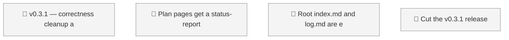
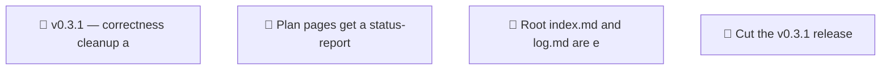

<!-- GENERATED by worklog roadmap-render. DO NOT EDIT. -->

> This file is generated from `.work/todo.jsonl`. Edits will be overwritten.
> To change the roadmap, change the work items: `worklog add|update|close`.

# Roadmap

_0 epic(s) in flight, 3 open item(s), 0 blocked, 0 unclassified._

## Now

_Nothing here._

## Next

### (no epic)

| # | Item | Type | Priority | Status | Blocked by |
|---|---|---|---|---|---|
| [31](https://github.com/SpillwaveSolutions/okf-plugin/issues/31) | Cut the v0.3.1 release | task | P1 | todo | — |
| [27](https://github.com/SpillwaveSolutions/okf-plugin/issues/27) | Plan pages get a status-report banner that ignores their status | task | P2 | todo | — |
| [30](https://github.com/SpillwaveSolutions/okf-plugin/issues/30) | Root index.md and log.md are exempt from all link validation | task | P2 | todo | — |

## Later

_Nothing here._

## Milestones

### v0.3.1

| # | Item | Type | Priority | Status | Blocked by |
|---|---|---|---|---|---|
| [31](https://github.com/SpillwaveSolutions/okf-plugin/issues/31) | Cut the v0.3.1 release | task | P1 | todo | — |
| [27](https://github.com/SpillwaveSolutions/okf-plugin/issues/27) | Plan pages get a status-report banner that ignores their status | task | P2 | todo | — |

## Visual roadmap

### Dependency graph

### Hierarchy

