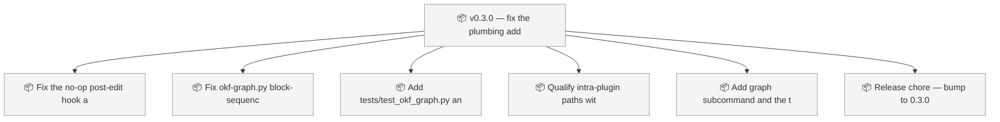
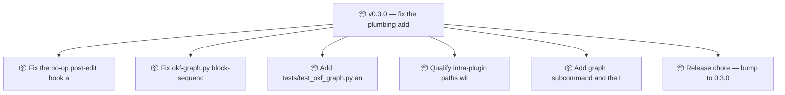

<!-- GENERATED by worklog roadmap-render. DO NOT EDIT. -->

> This file is generated from `.work/todo.jsonl`. Edits will be overwritten.
> To change the roadmap, change the work items: `worklog add|update|close`.

# Roadmap

_1 epic(s) in flight, 6 open item(s), 0 blocked, 0 unclassified._

## Now

### v0.3.0 — fix the plumbing, add the net  ·  P0  ·  0 of 6 done
Fix three verified defects in shipped v0.2.0 code (no-op post-edit hook, silently dropped block-sequence YAML, colliding Mermaid node IDs) and add the first automated coverage of scripts/okf-graph.py, the plugin's graph engine. CI and pre-commit gain a test step plus a strict sample-okf validation so these cannot regress.

| # | Item | Type | Priority | Status | Blocked by |
|---|---|---|---|---|---|
| 01KYZFDB | Fix the no-op post-edit hook and curate fallback | task | P0 | todo | — |
| 01KYZFDB | Fix okf-graph.py block-sequence YAML, Mermaid IDs, and add validate --strict | task | P0 | todo | — |
| 01KYZFDB | Add tests/test_okf_graph.py and wire it into CI and pre-commit | task | P0 | todo | — |

## Next

### v0.3.0 — fix the plumbing, add the net  ·  P0  ·  0 of 6 done
Fix three verified defects in shipped v0.2.0 code (no-op post-edit hook, silently dropped block-sequence YAML, colliding Mermaid node IDs) and add the first automated coverage of scripts/okf-graph.py, the plugin's graph engine. CI and pre-commit gain a test step plus a strict sample-okf validation so these cannot regress.

| # | Item | Type | Priority | Status | Blocked by |
|---|---|---|---|---|---|
| 01KYZFDB | Qualify intra-plugin paths with CLAUDE_PLUGIN_ROOT | task | P1 | todo | — |
| 01KYZFDB | Add graph subcommand and the two missing slash commands | task | P2 | todo | — |
| 01KYZFDB | Release chore — bump to 0.3.0 across the four manifests and README | task | P2 | todo | — |

## Later

_Nothing here._

## Visual roadmap

### Dependency graph

### Hierarchy

