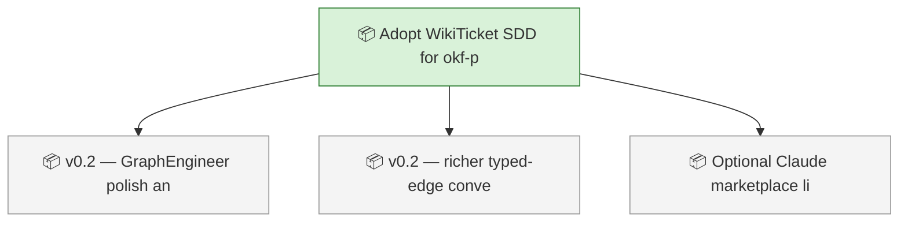
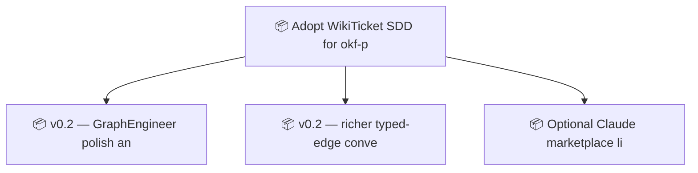

<!-- GENERATED by worklog roadmap-render. DO NOT EDIT. -->

> This file is generated from `.work/todo.jsonl`. Edits will be overwritten.
> To change the roadmap, change the work items: `worklog add|update|close`.

# Roadmap

_1 epic(s) in flight, 3 open item(s), 0 blocked, 0 unclassified._

## Now

_Nothing here._

## Next

### Adopt WikiTicket SDD for okf-plugin  ·  P1  ·  6 of 9 done  ·  → mixed
Manage okf-plugin with WikiTicket SDD (worklog): durable plans, event-log work items, generated roadmap, and GitHub Issues/wiki visibility for Claude Code and Grok Build work.

| # | Item | Type | Priority | Status | Blocked by |
|---|---|---|---|---|---|
| [4](https://github.com/RichardHightower/okf-plugin/issues/4) | v0.2 — GraphEngineer polish and progressive-disclosure defaults | task | P2 | todo | — |
| [5](https://github.com/RichardHightower/okf-plugin/issues/5) | v0.2 — richer typed-edge conventions and TicketLink SLDC helpers | task | P2 | todo | — |

## Later

### Adopt WikiTicket SDD for okf-plugin  ·  P1  ·  6 of 9 done
Manage okf-plugin with WikiTicket SDD (worklog): durable plans, event-log work items, generated roadmap, and GitHub Issues/wiki visibility for Claude Code and Grok Build work.

| # | Item | Type | Priority | Status | Blocked by |
|---|---|---|---|---|---|
| [6](https://github.com/RichardHightower/okf-plugin/issues/6) | Optional Claude marketplace listing for okf-graph-eng | task | P3 | todo | — |

## Milestones

### v0.2.0

| # | Item | Type | Priority | Status | Blocked by |
|---|---|---|---|---|---|
| [4](https://github.com/RichardHightower/okf-plugin/issues/4) | v0.2 — GraphEngineer polish and progressive-disclosure defaults | task | P2 | todo | — |
| [5](https://github.com/RichardHightower/okf-plugin/issues/5) | v0.2 — richer typed-edge conventions and TicketLink SLDC helpers | task | P2 | todo | — |
| [6](https://github.com/RichardHightower/okf-plugin/issues/6) | Optional Claude marketplace listing for okf-graph-eng | task | P3 | todo | — |

## Visual roadmap

### Dependency graph

### Hierarchy

