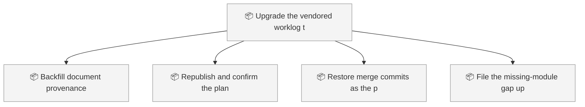
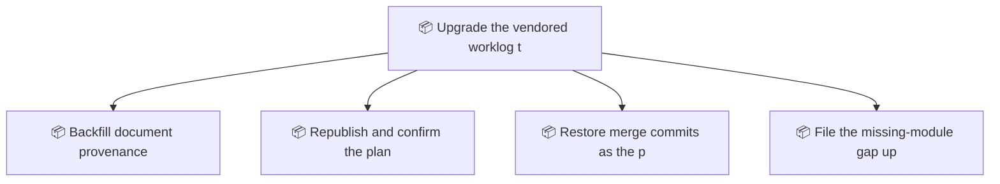

<!-- GENERATED by worklog roadmap-render. DO NOT EDIT. -->

> This file is generated from `.work/todo.jsonl`. Edits will be overwritten.
> To change the roadmap, change the work items: `worklog add|update|close`.

# Roadmap

_1 epic(s) in flight, 4 open item(s), 0 blocked, 0 unclassified._

## Now

_Nothing here._

## Next

### Upgrade the vendored worklog tooling to 0.22.2  ·  P2  ·  5 of 9 done  ·  feature 8 / bug 1
Upgrade this repo's vendored worklog tooling from 0.18.0 to 0.22.2 to pull in the plan-banner fix filed upstream as wiki_ticket_sdd#292, plus the trace-check scoping and merge-rescue correctness that shipped alongside it. Includes installing two modules the upstream installer omits, restoring merge commits so document provenance can be resolved, and republishing the wiki so plan pages stop announcing themselves as status reports.

| # | Item | Type | Priority | Status | Blocked by |
|---|---|---|---|---|---|
| 01KZD823 | Republish and confirm the plan banners are fixed | task | P1 | todo | — |
| 01KZD823 | Restore merge commits as the pull request merge style | task | P2 | todo | — |
| 01KZD823 | File the missing-module gap upstream | task | P2 | todo | — |

## Later

### Upgrade the vendored worklog tooling to 0.22.2  ·  P2  ·  5 of 9 done  ·  feature 8 / bug 1
Upgrade this repo's vendored worklog tooling from 0.18.0 to 0.22.2 to pull in the plan-banner fix filed upstream as wiki_ticket_sdd#292, plus the trace-check scoping and merge-rescue correctness that shipped alongside it. Includes installing two modules the upstream installer omits, restoring merge commits so document provenance can be resolved, and republishing the wiki so plan pages stop announcing themselves as status reports.

| # | Item | Type | Priority | Status | Blocked by |
|---|---|---|---|---|---|
| 01KZD823 | Backfill document provenance | task | P3 | todo | — |

## Visual roadmap

### Dependency graph

### Hierarchy

