<!-- GENERATED by worklog roadmap-render. DO NOT EDIT. -->

> This file is generated from `.work/todo.jsonl`. Edits will be overwritten.
> To change the roadmap, change the work items: `worklog add|update|close`.

# Roadmap

_1 epic(s) in flight, 8 open item(s), 0 blocked, 0 unclassified._

## Now

_Nothing here._

## Next

### v0.3.1 — correctness cleanup and traceability backfill  ·  P1  ·  2 of 9 done  ·  bug 6 / ops 3  ·  → v0.3.1
Clear the defects found while fixing v0.3.0: logic that is dead, silent, or wrong without crashing, plus the public traceability gap left by the move to the SpillwaveSolutions org. None break a run; all of them make the graph engine report something other than the truth, which is the failure mode that matters most for a dependency tool.

| # | Item | Type | Priority | Status | Blocked by |
|---|---|---|---|---|---|
| [14](https://github.com/SpillwaveSolutions/okf-plugin/issues/14) | Escalate unverified medium-impact concepts in criticality_of | task | P1 | todo | — |
| [15](https://github.com/SpillwaveSolutions/okf-plugin/issues/15) | Report ambiguous concept lookups instead of guessing | task | P2 | todo | — |
| [17](https://github.com/SpillwaveSolutions/okf-plugin/issues/17) | Make merge_edges precedence match what it documents | task | P2 | todo | — |
| [20](https://github.com/SpillwaveSolutions/okf-plugin/issues/20) | Backfill external tickets for closed work | task | P2 | todo | — |
| [21](https://github.com/SpillwaveSolutions/okf-plugin/issues/21) | Flag links that point outside the bundle | task | P2 | todo | — |

### (no epic)

| # | Item | Type | Priority | Status | Blocked by |
|---|---|---|---|---|---|
| [27](https://github.com/SpillwaveSolutions/okf-plugin/issues/27) | Plan pages get a status-report banner that ignores their status | task | P2 | todo | — |

## Later

### v0.3.1 — correctness cleanup and traceability backfill  ·  P1  ·  2 of 9 done  ·  bug 6 / ops 3
Clear the defects found while fixing v0.3.0: logic that is dead, silent, or wrong without crashing, plus the public traceability gap left by the move to the SpillwaveSolutions org. None break a run; all of them make the graph engine report something other than the truth, which is the failure mode that matters most for a dependency tool.

| # | Item | Type | Priority | Status | Blocked by |
|---|---|---|---|---|---|
| [19](https://github.com/SpillwaveSolutions/okf-plugin/issues/19) | Build the undirected adjacency once in subgraph | task | P3 | todo | — |
| [23](https://github.com/SpillwaveSolutions/okf-plugin/issues/23) | Skip dot-directories when loading a bundle | task | P3 | todo | — |

## Milestones

### v0.3.1

| # | Item | Type | Priority | Status | Blocked by |
|---|---|---|---|---|---|
| [14](https://github.com/SpillwaveSolutions/okf-plugin/issues/14) | Escalate unverified medium-impact concepts in criticality_of | task | P1 | todo | — |
| [15](https://github.com/SpillwaveSolutions/okf-plugin/issues/15) | Report ambiguous concept lookups instead of guessing | task | P2 | todo | — |
| [17](https://github.com/SpillwaveSolutions/okf-plugin/issues/17) | Make merge_edges precedence match what it documents | task | P2 | todo | — |
| [20](https://github.com/SpillwaveSolutions/okf-plugin/issues/20) | Backfill external tickets for closed work | task | P2 | todo | — |
| [21](https://github.com/SpillwaveSolutions/okf-plugin/issues/21) | Flag links that point outside the bundle | task | P2 | todo | — |
| [27](https://github.com/SpillwaveSolutions/okf-plugin/issues/27) | Plan pages get a status-report banner that ignores their status | task | P2 | todo | — |
| [19](https://github.com/SpillwaveSolutions/okf-plugin/issues/19) | Build the undirected adjacency once in subgraph | task | P3 | todo | — |
| [23](https://github.com/SpillwaveSolutions/okf-plugin/issues/23) | Skip dot-directories when loading a bundle | task | P3 | todo | — |

## Visual roadmap

### Dependency graph

```mermaid
graph TD
    01KZ2CAAT56M9V49211G7NVBYV["🐛 Escalate unverified medium-imp"]
    01KZ2CAAT5C7PGNP8QDXGJJB9E["🐛 Report ambiguous concept looku"]
    01KZ2CAAT5G2ND3RAF4TAXR5B9["🔧 v0.3.1 — correctness cleanup a"]
    01KZ2CAAT5JS108XWJ4T00B3V1["🐛 Make merge_edges precedence ma"]
    01KZ2CAAT64CERBRZMR7AJZ5XW["🔧 Build the undirected adjacency"]
    01KZ2CAAT66ZFTBX9NQ7Z0AKKX["🔧 Backfill external tickets for"]
    01KZ2CAAT6XQ5WCT70AS6QQNTY["🐛 Flag links that point outside"]
    01KZ2CAAT6Z9Q09MMFFWD7XH1R["🐛 Skip dot-directories when load"]
    01KZ2CYK20RWGPSEE6VGZ3NHBP["🐛 Plan pages get a status-report"]
    01KZ2CAAT5G2ND3RAF4TAXR5B9 --> 01KZ2CAAT56M9V49211G7NVBYV
    01KZ2CAAT5G2ND3RAF4TAXR5B9 --> 01KZ2CAAT5C7PGNP8QDXGJJB9E
    01KZ2CAAT5G2ND3RAF4TAXR5B9 --> 01KZ2CAAT5JS108XWJ4T00B3V1
    01KZ2CAAT5G2ND3RAF4TAXR5B9 --> 01KZ2CAAT64CERBRZMR7AJZ5XW
    01KZ2CAAT5G2ND3RAF4TAXR5B9 --> 01KZ2CAAT66ZFTBX9NQ7Z0AKKX
    01KZ2CAAT5G2ND3RAF4TAXR5B9 --> 01KZ2CAAT6XQ5WCT70AS6QQNTY
    01KZ2CAAT5G2ND3RAF4TAXR5B9 --> 01KZ2CAAT6Z9Q09MMFFWD7XH1R
    classDef todo fill:#f4f4f4,stroke:#999999
    class 01KZ2CAAT56M9V49211G7NVBYV,01KZ2CAAT5C7PGNP8QDXGJJB9E,01KZ2CAAT5G2ND3RAF4TAXR5B9,01KZ2CAAT5JS108XWJ4T00B3V1,01KZ2CAAT64CERBRZMR7AJZ5XW,01KZ2CAAT66ZFTBX9NQ7Z0AKKX,01KZ2CAAT6XQ5WCT70AS6QQNTY,01KZ2CAAT6Z9Q09MMFFWD7XH1R,01KZ2CYK20RWGPSEE6VGZ3NHBP todo
```

### Hierarchy

```mermaid
graph TD
    01KZ2CAAT56M9V49211G7NVBYV["🐛 Escalate unverified medium-imp"]
    01KZ2CAAT5C7PGNP8QDXGJJB9E["🐛 Report ambiguous concept looku"]
    01KZ2CAAT5G2ND3RAF4TAXR5B9["🔧 v0.3.1 — correctness cleanup a"]
    01KZ2CAAT5JS108XWJ4T00B3V1["🐛 Make merge_edges precedence ma"]
    01KZ2CAAT64CERBRZMR7AJZ5XW["🔧 Build the undirected adjacency"]
    01KZ2CAAT66ZFTBX9NQ7Z0AKKX["🔧 Backfill external tickets for"]
    01KZ2CAAT6XQ5WCT70AS6QQNTY["🐛 Flag links that point outside"]
    01KZ2CAAT6Z9Q09MMFFWD7XH1R["🐛 Skip dot-directories when load"]
    01KZ2CYK20RWGPSEE6VGZ3NHBP["🐛 Plan pages get a status-report"]
    01KZ2CAAT5G2ND3RAF4TAXR5B9 --> 01KZ2CAAT56M9V49211G7NVBYV
    01KZ2CAAT5G2ND3RAF4TAXR5B9 --> 01KZ2CAAT5C7PGNP8QDXGJJB9E
    01KZ2CAAT5G2ND3RAF4TAXR5B9 --> 01KZ2CAAT5JS108XWJ4T00B3V1
    01KZ2CAAT5G2ND3RAF4TAXR5B9 --> 01KZ2CAAT64CERBRZMR7AJZ5XW
    01KZ2CAAT5G2ND3RAF4TAXR5B9 --> 01KZ2CAAT66ZFTBX9NQ7Z0AKKX
    01KZ2CAAT5G2ND3RAF4TAXR5B9 --> 01KZ2CAAT6XQ5WCT70AS6QQNTY
    01KZ2CAAT5G2ND3RAF4TAXR5B9 --> 01KZ2CAAT6Z9Q09MMFFWD7XH1R
```

