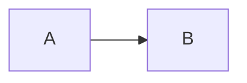

# OKF Query & Progressive Disclosure

## Goal

Answer graph questions and emit **minimal context packs** (subgraphs) instead of dumping entire directories.

## Query types

| Intent | Approach |
|--------|----------|
| Neighbors of X | 1-hop inbound + outbound |
| Context pack for agent run | 2-hop subgraph around entry agent + shared state |
| Routing path A → B | BFS / path search on agent-graph edges |
| By type | Filter concepts where frontmatter `type` matches |
| By tag | Filter on `tags` |
| Trust slice | Prefer `verified: true` and non-stale nodes |

## Process

1. Resolve bundle root and query target(s).
2. Prefer deterministic tools:
   - `okf graph`, search, or list commands if available
   - Fallback (defaults: **2 hops**, **20 nodes**):
     ```bash
     python3 "${CLAUDE_PLUGIN_ROOT}/scripts/okf-graph.py" pack <bundle> <concept> --hops 2 --max-nodes 20
     python3 "${CLAUDE_PLUGIN_ROOT}/scripts/okf-graph.py" subgraph <bundle> <concept> --hops 2
     python3 "${CLAUDE_PLUGIN_ROOT}/scripts/okf-graph.py" backlinks <bundle> <concept>
     python3 "${CLAUDE_PLUGIN_ROOT}/scripts/okf-graph.py" edges <bundle> --rel routes_to
     ```
3. Shape results for the consumer:
   - **Human / agent pack**: use `pack` → `markdown` field (preferred)
   - **JSON**: nodes + typed edges for downstream steps
4. Cap pack size. Default hops = 2, max-nodes = 20. Increase only if the user needs deeper context.
5. Annotate trust: mark unverified or draft nodes so consumers can deprioritize them.

Deep reference: `references/progressive-disclosure.md`.

## Progressive disclosure pack format

```markdown
# Context pack: <root concept>
Hops: 2 | Nodes: N | Generated: <timestamp>

## Entry
- path, type, one-line description

## Included concepts (read order)
1. ...
2. ...

## Graph (Mermaid)


## Excluded (available on request)
- siblings / deeper hops summary
```

## Rules

- Prefer verified, active nodes when trimming packs under a size budget.
- Do not silently omit high-impact unverified nodes — flag them.
- Absolute paths in links inside packs so agents can open files reliably.
- Never fabricate nodes missing from the bundle.

## Done when

- Query answered with explicit hop depth and node count
- Pack is small enough for agent context (or user approved a larger extract)
