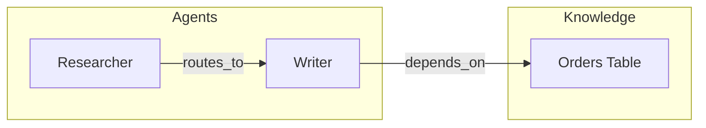

# OKF Visualize

## Goal

Produce readable graph views of the OKF dual graph, with optional **agent-graph overlays** (agents, workflows, routes).

## Output modes

| Mode | When |
|------|------|
| **Mermaid** | Docs, PRs, chat — default |
| **JSON** | Downstream tools / further agent steps |
| **HTML** | Standalone shareable map (simple self-contained page) |

## Process

1. Resolve bundle and optional focus concept / filter (type, tag, hops).
2. Extract graph:
   ```bash
   okf graph <bundle>   # if available
   # or focused extract:
   python3 "${CLAUDE_PLUGIN_ROOT}/scripts/okf-graph.py" subgraph <bundle> <concept> --hops 2
   ```
   For full-bundle views, crawl all concepts via `validate` load path or walk `*.md` with the Python helper patterns.
3. Choose layout:
   - **Knowledge view** — hide pure harness types or style them differently
   - **Agent view** — emphasize `AgentNode`, `Workflow`, `SharedState`, route edges
   - **Combined** — full dual graph with type-based styling
4. Emit artifact to the path the user requested (or inline Mermaid in chat).

## Mermaid conventions



- Use node labels = titles; keep IDs filesystem-safe.
- Edge labels optional (`routes_to`, `depends_on`).
- Cap diagrams at ~40 nodes; otherwise filter or multi-diagram by subgraph.

## HTML sketch

Self-contained HTML with:

- Title + generated timestamp
- Embedded Mermaid via CDN **or** static SVG if Mermaid unavailable offline
- Legend for knowledge vs agent types
- Optional table of concepts (title, type, verified)

Prefer writing to something like `docs/okf-graph.html` only when the user wants a file.

## JSON shape

```json
{
  "nodes": [{"id": "...", "title": "...", "type": "...", "verified": false}],
  "edges": [{"from": "...", "to": "...", "rel": "links_to"}]
}
```

## Rules

- Never invent edges; only render discovered links.
- State hop limits and filters in the diagram title/subtitle.
- For huge bundles, default to agent-view or 2-hop focus rather than a hairball.

## Done when

- User has a Mermaid block and/or file artifact matching the requested mode
- Legend or caption explains filters and dual-graph overlay
