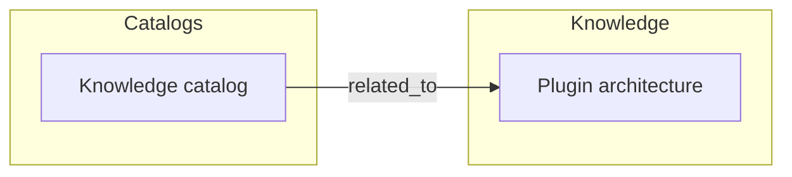

# OKF Visualize

## Goal

Produce readable graph views of an OKF bundle. Type styling comes from frontmatter `type` — this plugin does not special-case AgentNode or other domain nouns.

## Output modes

| Mode | When |
|------|------|
| **Mermaid** | Docs, PRs, chat — default |
| **JSON** | Downstream tools / further agent steps |
| **HTML** | Standalone shareable map (simple self-contained page) |

## Process

1. Resolve bundle and optional focus concept / filter (type, tag, hops).
2. Render the graph:
   ```bash
   okf graph <bundle>   # if available
   # fallback — whole bundle, fenced Mermaid on stdout:
   python3 "${CLAUDE_PLUGIN_ROOT}/scripts/okf-graph.py" graph <bundle>
   # focused neighborhood:
   python3 "${CLAUDE_PLUGIN_ROOT}/scripts/okf-graph.py" graph <bundle> --focus <concept> --hops 2
   # other formats:
   python3 "${CLAUDE_PLUGIN_ROOT}/scripts/okf-graph.py" graph <bundle> --format json
   python3 "${CLAUDE_PLUGIN_ROOT}/scripts/okf-graph.py" graph <bundle> --format html > docs/okf-graph.html
   ```
   `--format json` prints JSON; `mermaid` (default) and `html` print the artifact
   itself, so they pipe straight into a doc or a file. Node IDs come from the
   full concept path, so the bundle's many `index.md` files stay distinct.
3. Choose layout:
   - **Whole bundle** — default
   - **Focus** — `--focus` + hops for a neighborhood
   - **By type** — filter on frontmatter `type` when the user asks
4. Emit artifact to the path the user requested (or inline Mermaid in chat).

## Mermaid conventions



- Use node labels = titles; keep IDs filesystem-safe.
- Edge labels optional (`depends_on`, `related_to`).
- Cap diagrams at ~40 nodes; otherwise filter or multi-diagram by subgraph.

## HTML

`--format html` emits one self-contained page — no CDN, no scripts, no network
fetches, so it opens from disk and survives a locked-down viewer. It carries:

- Title, caption (focus + hops), generated timestamp, node/edge counts
- Mermaid source in `<pre class="mermaid">` — drawn by renderers that
  understand it, readable as text everywhere else
- Concept table (title, path, type, verified) and edge table (from, rel, to)

Write it to a file (e.g. `docs/okf-graph.html`) only when the user wants one;
never re-add a CDN `<script>` to make it "render properly".

## JSON shape

```json
{
  "nodes": [{"id": "...", "title": "...", "type": "...", "verified": false}],
  "edges": [{"from": "...", "to": "...", "rel": "links_to"}]
}
```

## Rules

- Never invent edges; only render discovered links.
- State hop limits and filters in the diagram title/subtitle.
- For huge bundles, default to 2-hop focus rather than a hairball.

## Done when

- User has a Mermaid block and/or file artifact matching the requested mode
- Legend or caption explains filters
